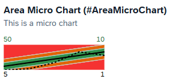

# @UI.chart

## 1. BulletChart

### 定义

```abap
@UI.chart: [
  {
    qualifier: 'bulletChart',
    title: 'Bullet Micro Chart (#BulletMicroChart)',
    description: 'This is Bullet Micro Chart',
    chartType: #BULLET,
    measures: ['AValue'],
    measureAttributes: [
      {
        measure: 'AValue',
        role: #AXIS_1,
        asDataPoint: true
      }
    ]
  }
]

  @UI:{
    dataPoint: { 
      qualifier: 'AValue',
      targetValueElement: 'BValue',
      forecastValue: 'CValue',
      criticality: 'DValue',
      minimumValue: 0
    }
  }
  @EndUserText.label: 'Value A'
  AValue;
```

在Chart中定义图表类型后measures选定字段，然后去字段上的@UI.dataPoint设定其他变量

在BulletChart中

qualifier表示实际数量 图中为深色部分
targetValueElement表示目标数量 图中为竖线
forecastValue表示预测数量 图中为浅色部分
criticality表示主题颜色


### 在表中

```abap
  @UI:{
    lineItem: [
        {
            label: 'bulletChart',
            position: 25,
            type: #AS_CHART,
            importance: #HIGH,
            valueQualifier: 'bulletChart'
        }
    ]
  }
```

### 在facet中

```abap
  @UI:{
    facet: [
      {
        parentId   : 'FacetCollection',
        type       : #CHART_REFERENCE,
        targetQualifier: 'bulletChart'
      }
    ]
  }
```

## 2. RadialChart

### 定义

```abap
@UI.chart: [
  {
    qualifier: 'radialChart',
    title: 'Radial Micro Chart (#RadialMicroChart)',
    description: 'This is Radial Micro Chart',
    chartType: #DONUT,
    measures: ['AValue'],
    measureAttributes: [
      {
        measure: 'AValue',
        role: #AXIS_1,
        asDataPoint: true
      }
    ]
  }
]

  @UI:{
    dataPoint: { 
      qualifier: 'AValue',
      targetValueElement: 'BValue',
      criticality: 'DValue',
    }
  }
  AValue;
```

其中 qualifier为分子，targetValueElement为分母，图中显示为AValue/BValue的值，超过100%的则会显示为100%
DValue是主题颜色


## 3.Rating

### 定义

```abap
  @UI:{ 
    dataPoint: { 
        qualifier: 'StarsValue',
        targetValue: 5,
        visualization: #RATING,
        title: 'Rating Indicator (#DataPointRating)'
    }
  }
  EValue;
```


### 在facet中

```abap
  @UI.facet: [
    {
      parentId        : 'FacetCollection',
      type            : #DATAPOINT_REFERENCE,
      targetQualifier : 'StarsValue'
    }
  ]
```

### 在表中

```abap
  @UI:{
    lineItem: [
      {
        type: #AS_DATAPOINT,
        label: 'Rating',
        importance: #LOW,
        position: 23
      },
    ]
  }
```

原则上是这样，但是我遇到了不明bug在表中不显示

## 4.饼图 有问题先欠着

## 5.AreaChart

### 定义

```abap
@UI.chart: [
  // Search Term #AreaMicroChart
  {
    qualifier: 'areaChart',
    title: 'Area Micro Chart (#AreaMicroChart)',
    description: 'This is a micro chart',
    chartType: #AREA,
    dimensions: ['BValue'],
    measures: ['AValue'],
    measureAttributes: [
      {
        measure: 'AValue',
        role: #AXIS_1,
        asDataPoint: true
      }
    ]
  }
]
  @UI: {
    lineItem: [{ label: 'A', position: 50 }],
    // Search Term #AreaMicroChart
    dataPoint: {
      qualifier: 'AValue',
      targetValueElement: 'AValue',
      criticalityCalculation: {
        improvementDirection: #TARGET,
        toleranceRangeLowValueElement: 'CValue',
        toleranceRangeHighValueElement: 'DValue',
        deviationRangeHighValueElement: 'EValue',
        deviationRangeLowValueElement: 'FValue'
      }
    }
  }
  AValue;
```


数据部分

