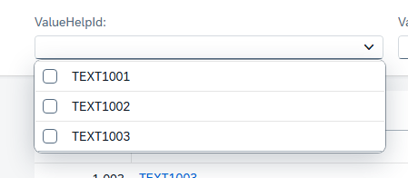
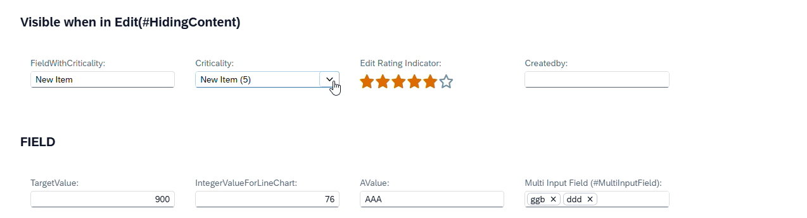
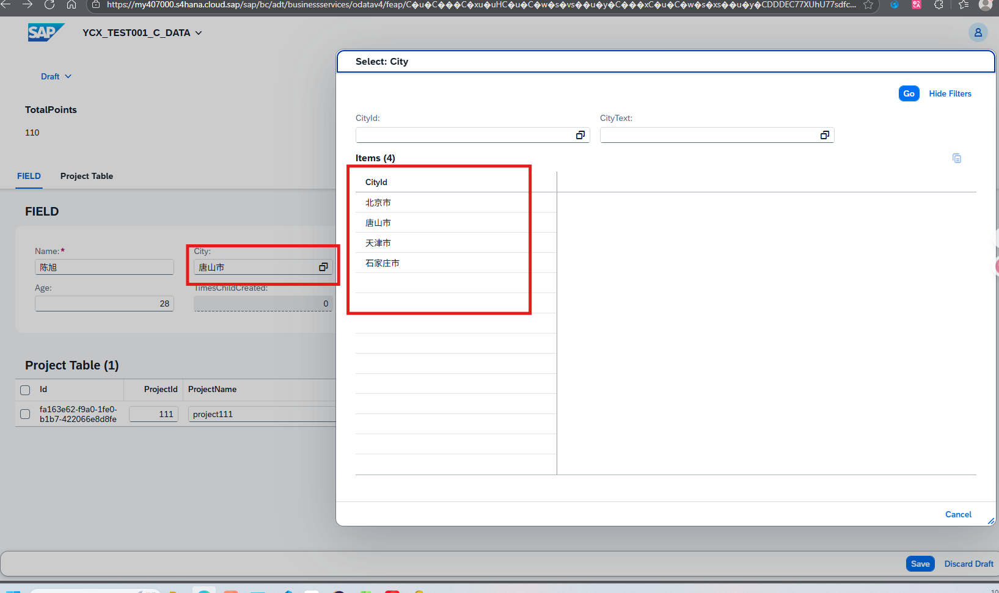

### **@Consumption.valueHelpDefinition**


###### **a. qualifier**

说明：值帮助的唯一标识符（当同一字段有多个值帮助时需区分）。


留空场景：单个值帮助时可为空 ''。


###### **b. entity**

说明：指定值帮助的数据源实体（CDS 视图）。


子属性：


name：值帮助实体名称（格式：命名空间.实体名）。

element：值帮助实体中返回的字段名。


###### **c. distinctValues**

说明：是否自动去重值帮助结果（避免重复值）。


类型：布尔值（true/false）。


###### **d. useForValidation**

说明：是否用值帮助验证用户输入（输入值必须在值帮助列表中）。


类型：布尔值（true/false）。


示例值：true（需严格校验时启用）。


###### **e. enabled**

说明：动态启用/禁用值帮助的条件（基于其他字段值）。


语法：ABAP CDS 条件表达式。


###### f. additionalBinding

说明：向值帮助传递额外参数（如过滤条件）。


子属性：

|属性	        |说明	|
|---------------|-----------------------------------------|
|localParameter	|值帮助实体中的参数名（需在值帮助 CDS 中定义）|
|localElement	|值帮助实体中的字段名（用于过滤）|
|localConstant	|直接传递常量值到值帮助	|
|parameter	    |当前实体的参数名（从父视图传递）|
|element	    |当前实体的字段名（将字段值动态传递给值帮助）              |
|usage	        |绑定用途（常用 #FILTER 过滤数据，或 #PARAMETERS 传递参数）|


###### **g. label**

说明：值帮助弹窗的标题文本。（支持 @i18n 国际化注解）


###### **h. presentationVariantQualifier**

说明：关联 [@UI.presentationVariant](@UI.presentationVariant.md) 注解，控制值帮助的排序/分组/列显示。


###### **j.关键使用场景**

动态过滤：通过 [additionalBinding](#additionalbinding) 将当前字段值传递给值帮助（如根据国家筛选物料）。


多值帮助：用 qualifier 区分同一字段的不同值帮助（如按类型提供不同帮助）。


校验输入：useForValidation: true 确保输入值合法。


优化显示：presentationVariantQualifier 控制值帮助的列布局和排序。


通过合理配置这些属性，可以高效实现复杂的值帮助逻辑，提升用户体验。


###### **例：**	
```
@Consumption.valueHelpDefinition: [{
           qualifier: '',
           entity: {
               name: '',
               element: ''
           },
           distinctValues: true,
           useForValidation: true,
           enabled: '',
           additionalBinding: [{
               localParameter: '',
               localElement: '',
               localConstant: '',
               parameter: '',
               element: '',
               usage: 
           }],
           label: '',
           presentationVariantQualifier: ''
       }]
```

###### **其他**
写入value help cds entity 中会使其变成下拉列表



@ObjectModel : { resultSet.sizeCategory: #XS }

###### **例：**	
```
@AccessControl.authorizationCheck: #NOT_REQUIRED
@EndUserText.label: 'YCX_VH_VALUEHELP'
@Metadata.ignorePropagatedAnnotations: true

@ObjectModel : { resultSet.sizeCategory: #XS }

@UI.headerInfo: {
  typeName: 'ValueHelp',
  typeNamePlural: 'ValueHelps',
  title.value: 'Text',
  description.value: 'Text',
  typeImageUrl: 'sap-icon://blank-tag'
}

define view entity YCX_VH_VALUEHELP as select from ycxvaluehelp
{...}
```

## additionalBinding
> 要实现以下功能需要要用到@Consumption.valueHelpDefinition中的additionalBinding，localElement设置与Criticality一起改变的字段
> FieldWithCriticality
> 
cds
```
@Consumption.valueHelpDefinition: [{ entity: { name: 'YCX_I_CRITICALITY', element: 'Code' },
                                    additionalBinding: [{ element: 'Name',
                                                                localElement: 'FieldWithCriticality',
                                                                usage: #RESULT }] } ]
Criticality
```




## 例


YCX_TEST001_DATA
```
define root view entity YCX_TEST001_DATA as select from ycxcreatedata
...
association [0..1]       to YCX_TEST001_VH_CITY  as _VHCITY  on  $projection.City = _VHCITY.CityId
{
    ...
    city as City,
    ...
    _VHCITY
}
```

YCX_TEST001_C_DATA
```
define root view entity YCX_TEST001_C_DATA
  provider contract transactional_query as projection on YCX_TEST001_DATA
{
    ...

    @ObjectModel.foreignKey.association: '_VHCITY'
    @Consumption.valueHelpDefinition: [{ entity: { name: 'YCX_TEST001_VH_CITY', element: 'CityId' } } ]
    City,
    ...
    _VHCITY,
    ...
}

```

cds YCX_TEST001_VH_CITY
> @UI.textArrangement 加入的显示效果请看[其他里的@UI.textArrangement](其他.md)部分
>
> 要想在valuehelp弹窗中点击数据之后 输入框 也只显示文本（ CityText ）字段内容 还需要在 所用输入框字段上 加入@UI.textArrangement 还要在valuehelp 的cds上用到 @ObjectModel.text.element: ['CityText'] 
> 
```
@AccessControl.authorizationCheck: #NOT_REQUIRED
@EndUserText.label: 'YCX_TEST001_VH_CITY'
//@ObjectModel : { resultSet.sizeCategory: #XS }
define root view entity YCX_TEST001_VH_CITY as select from ycxtest001vhcity
{
    @UI.textArrangement: #TEXT_ONLY
    @ObjectModel.text.element: ['CityText'] 
    @Consumption.valueHelpDefault.display:false
    key city_id as CityId,
    
    city_text as CityText
}
```

Service Definitions ( YCX_SD_TRAVEL )
```
@EndUserText.label: 'YCX_SD_TRAVEL'
define service YCX_SD_TRAVEL {
    ...
  expose YCX_TEST001_C_DATA    as DATA;
  expose YCX_TEST001_C_PROJECT as PROJECT;
  expose YCX_TEST001_VH_CITY   as VHCITY;
}
```


