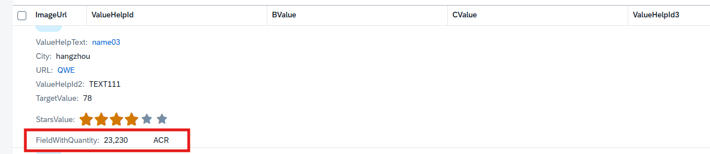
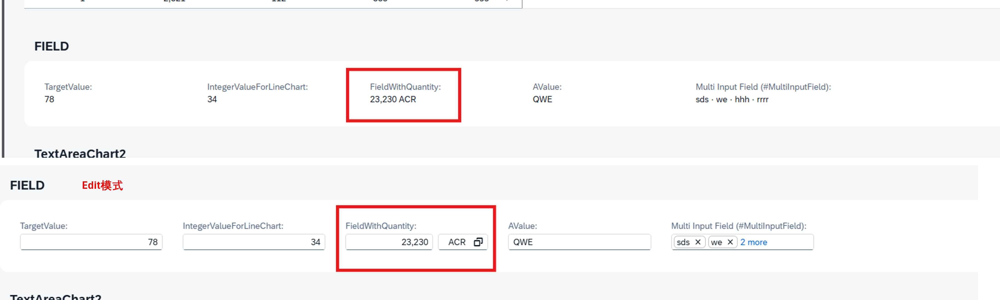
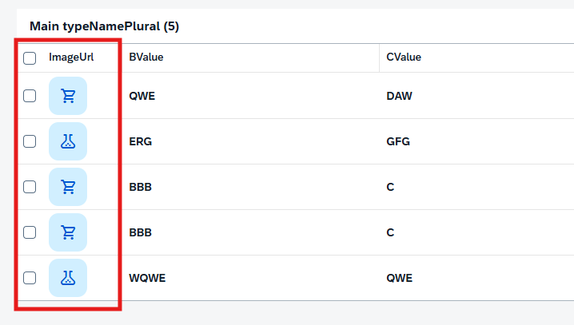

* @Semantics

> @Semantics 注解用于为字段赋予业务语义。它告诉底层框架（如 ABAP 或 CAP）和前端 Fiori Elements 如何解释和处理这个字段的数据，而不仅仅是知道它的数据类型（如 String, Decimal）。
> 简单来说，它的作用是：“这个字段不仅仅是一个数字/字符串，它代表的是金额、数量、日期、货币代码...”
> 


> @Semantics.address.* - 用于地址相关字段
> 
> @Semantics.currencyCode - 用于货币代码字段
> 
> @Semantics.amount.currencyCode - 用于金额字段（带货币）
> 
> @Semantics.language - 用于语言字段
> 

> 使用 @Semantics.address.label: true之后会给弹窗中的address赋值，但会覆盖 @Semantics.address.country: true，@Semantics.address.city: true等在address拼接之后的值
>
> @Semantics.eMail.type: [ #PREF ] - 会生成邮件链接
> 
> @Semantics.telephone.type: [ #PREF ] - 生成电话链接
>
> [@Semantics.quantity.unitOfMeasure : 'ycxmaintable.uom'](#semanticsquantityunitofmeasure)  - 语义注释允许对仅对消费方有影响的语义（例如货币代码表示和金额）进行标准化。
>
> [@Semantics.imageUrl: true](#semanticsimageurl-true) - 会把图片url转成图片
>
> [@Semantics.largeObject](#semanticslargeobject-and-semanticsmimetype) - 可以为 RAP 应用程序启用维护大型对象（LOB）的功能
>
> [@Semantics.mimeType: true](#semanticslargeobject-and-semanticsmimetype) - 定义字段类型为MimeType


```
@AccessControl.authorizationCheck: #NOT_REQUIRED
@EndUserText.label: 'YCX_VH_VALUEHELP'


@ObjectModel : { resultSet.sizeCategory: #XS }
@UI.headerInfo: {
  typeName: 'ValueHelp',
  typeNamePlural: 'ValueHelps',
  title.value: 'Text',
  description.value: 'Text',
  typeImageUrl: 'sap-icon://blank-tag'
}

define view entity YCX_VH_VALUEHELP as select from ycxvaluehelp
{
  @UI.facet: [
    {
      type: #FIELDGROUP_REFERENCE,
      label: 'Value Help',
      targetQualifier: 'data',
      purpose: #QUICK_VIEW
    },
    {
      type: #IDENTIFICATION_REFERENCE,
      label: 'Value Help'
    }
  ]
  @UI.textArrangement: #TEXT_ONLY
  @Consumption.valueHelpDefault.display:false
  @ObjectModel.text.element: ['Text'] // Search Term #DisplayTextAndID
    key id as Id,
    
  @EndUserText.label : 'String Text'
  @UI: {
    multiLineText: true,
    fieldGroup: [{ qualifier: 'data', position: 10 }],
    lineItem: [{ position: 1 }],
    identification: [{ position: 1 }]
  }
    @Consumption.valueHelpDefault.display:true
    text as Text,
    @Consumption.valueHelpDefault.display:false
    createdby as Createdby,
    @Consumption.valueHelpDefault.display:false
    createdat as Createdat,
    @Consumption.valueHelpDefault.display:false
    locallastchangedby as Locallastchangedby,
    @Consumption.valueHelpDefault.display:false
    locallastchangedat as Locallastchangedat,
    @Consumption.valueHelpDefault.display:false
    lastchangedat as Lastchangedat,
    @Semantics.name.fullName: true
    name as Name,
    @Semantics.telephone.type: [#PREF]
    phone as Phone,
    @Consumption.valueHelpDefault.display:false
    building as Building,
    @Semantics.address.country: true
    country as Country,
    @Consumption.valueHelpDefault.display:false
    @Semantics.address.street: true
    street as Street,
    @Consumption.valueHelpDefault.display:true
    @Semantics.address.city: true
    city as City,
    @Consumption.valueHelpDefault.display:false
    postcode as Postcode,
    
    @Semantics.address.label: true
    @Consumption.valueHelpDefault.display:false
    address_label as AddressLabel,
    @Consumption.valueHelpDefault.display:false
    photo_url as PhotoUrl,
    
    @Consumption.valueHelpDefault.display:false
    @Semantics.eMail.type: [ #PREF ]
    email as Email
}
```


## @Semantics.quantity.unitOfMeasure

> 注意点：在 CDS 视图实体中，对于数据类型为 abap.quan 的所有元素和所有计算数量都是必需的。可用于其他数据类型的 CDS 数量字段。在所有其他 CDS 实体中是可选的。
> 
ycxmaintable表
```
  @Semantics.quantity.unitOfMeasure : 'ycxmaintable.uom'
  field_with_quantity            : abap.quan(15,3);
  uom                            : msehi;
```
> 这里需要用到 @UI.lineItem 和 @UI.fieldGroup
>
```
@UI:{
    lineItem: [
      {
        label: 'FieldWithQuantity',
        importance: #LOW,
        position: 92
      }
    ],
    fieldGroup: [{ qualifier: 'FIELD' ,label:'FieldWithQuantity'}]
}
FieldWithQuantity;
```


 


## @Semantics.imageUrl: true
> image_url字段类型为abap.char(256);还需用到@UI.lineItem在表中显示
cds
```
@Semantics.imageUrl: true
image_url as ImageUrl,
```



## @Semantics.largeObject and @Semantics.mimeType
> 为用户提供了在编辑实体实例时包含外部二进制文件或文本文件的选项。首先，应在数据库表和 CDS 视图中添加适当的字段，并添加注释 @Semantics.largeObject 和 @Semantics.mimeType。若要在表格中显示，您还需要注释 @UI.lineItem。
>
> 注意如果上传完图片，在子页面没有显示，请清理一下缓存再重新尝试
>
> 想让图片显示在子页面header中请看[@UI.headerInfo属性详解](@UI.headerInfo/@UI.headerInfo属性详解.md)中的imageUrl部分 只需要在imageUrl中填入StreamFile字段  


cds
```
StreamFilename,

@Semantics.largeObject: {
  acceptableMimeTypes: [ 'image/*', 'application/*' ],  // 为相关流属性提供可接受的MIME类型列表，以根据此限制或验证用户输入。若接受任意子类型，可用 * 号表示。
  cacheControl.maxAge: #MEDIUM,  // 缓存控制最大时间
  contentDispositionPreference: #ATTACHMENT , // #ATTACHMENT - download as file
                                            // #INLINE - 浏览器直接预览
  fileName: 'StreamFilename',
  mimeType: 'StreamMimeType'
}
StreamFile,

@Semantics.mimeType: true
StreamMimetype
```

table
```
@EndUserText.label : 'YCXCHILD'
@AbapCatalog.enhancement.category : #NOT_EXTENSIBLE
@AbapCatalog.tableCategory : #TRANSPARENT
@AbapCatalog.deliveryClass : #A
@AbapCatalog.dataMaintenance : #RESTRICTED
define table ycxchild {

  key client         : abap.clnt not null;
  key id             : sysuuid_x16 not null;
  parent_id          : sysuuid_x16;
  string_property    : abap.char(1024);
  field_with_percent : abap.dec(5,2);
  boolean_property   : abap_boolean;
  criticality_code   : /dmo/fsa_criticality;
  stream_is_readonly : abap_boolean;
  stream_filename    : abap.char(128);
  stream_mimetype    : abap.char(128);
  stream_file        : abap.rawstring(0);
  child_pieces       : abap.int4;

}
```

