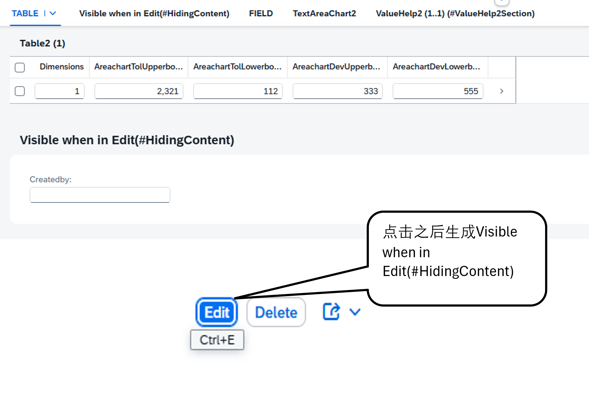
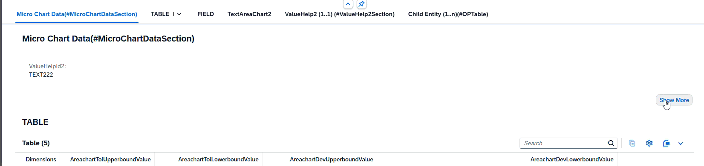
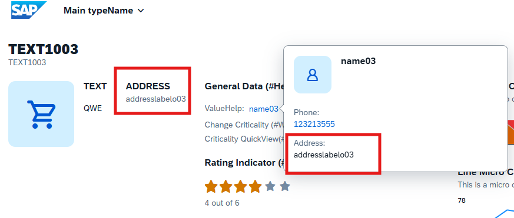
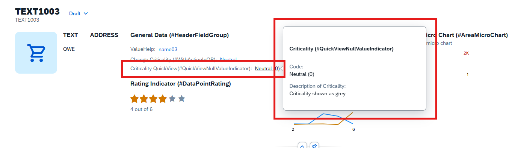
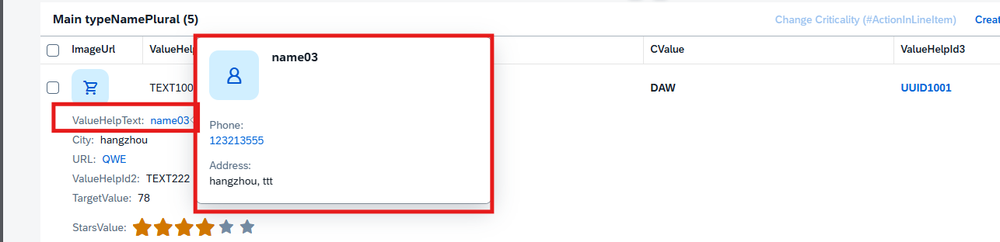

### **4-1，@UI.facet Annotation 属性详解**

@UI.facet 是 SAP BTP RAP (Restful ABAP Programming) 开发中用于定义对象页面中 facet（分面/区域）的注解。以下是各个属性的详细说明：
   
#### **目录**
- [**4-1，@UI.facet Annotation 属性详解**](#4-1uifacet-annotation-属性详解)
  - [**目录**](#目录)
  - [**a，基本属性**](#a基本属性)
  - [**b，布局与可见性控制**](#b布局与可见性控制)
  - [**c，内容与显示**](#c内容与显示)
  - [**d，导航与交互**](#d导航与交互)
  - [**e，实际应用示例**](#e实际应用示例)
  
#### **a，基本属性**

> qualifier: 限定符，用于区分同类型的facet
> 
> feature: 关联的功能特性
> 
> id: facet的唯一标识符
> 
> purpose: facet的用途，常用值：
> 
> [#STANDARD](#standard) - 标准facet
> 
> [#HEADER](#header) - 头部区域 
>   
> [#QUICK_VIEW](#quick_view) - 弹窗设置所用


#### **b，布局与可见性控制**

> parentId: 父facet的ID（用于嵌套结构）
> 
> position: facet在页面中的位置（数字决定显示顺序）
> 
> exclude: true/false - 是否从页面中排除此facet
> 
> hidden: true/false - 是否隐藏此facet（用户可通过个性化设置显示）
> 
> [isPartOfPreview: true/false](#ispartofpreview) - 是否包含在预览中
> 
> isSummary: true/false - 是否为摘要facet
> 
> isMap: true/false - 是否为地图facet


#### **c，内容与显示**

> importance: facet的重要性级别：
> 
> \#HIGH - 高重要性
> 
> \#MEDIUM - 中等重要性
> 
> \#LOW - 低重要性
> 
> label: facet的标题文本
> 
> type: facet的类型，常用值：
> 
> [#FIELDGROUP_REFERENCE](#typefieldgroup_reference) - 字段组
> 
> [#CHART_REFERENCE](#typechart_reference) - 图表
> 
> \#TABLE - 表格
> 
> [#LINEITEM_REFERENCE](#typelineitem_reference) - 行项目
> 
> \#IDENTIFICATION - 标识区域
> 
> [#DATAPOINT_REFERENCE](#datapoint_reference) - 数据点
> 
> [#PRESENTATIONVARIANT_REFERENCE](#presentationvariant_reference)
> 
> [#ADDRESS_REFERENCE](#typeaddress_reference)


#### **d，导航与交互**

> targetElement: 目标元素（用于导航）
> 
> targetQualifier: 目标限定符
> 
> url: 关联的URL链接


#### **e，实际应用示例**

e-1. 标准字段组facet
```
@UI.facet: [{
   id: 'GeneralInfo',
   type: #FIELDGROUP_REFERENCE,
   label: 'General Information',
   position: 10,
   purpose: #STANDARD
}]
```
e-2. 表格行项目facet
```
@UI.facet: [{
   id: 'OrderItems',
   type: #LINEITEM_REFERENCE,
   label: 'Order Items',
   position: 20,
   targetElement: 'ItemsTable'
}]
```
e-3. [图表facet](#header)
```
@UI.facet: [{
   id: 'SalesChart',
   type: #CHART_REFERENCE,
   label: 'Sales Performance',
   position: 30,
   purpose: #STANDARD
}]
```
e-4. [嵌套facet结构](#standard)
```
@UI.facet: [{
   id: 'MainSection',
   label: 'Main Section',
   position: 10,
   type: #FIELDGROUP
}, {
   id: 'SubSection',
   label: 'Details',
   position: 20,
   parentId: 'MainSection',
   type: #FIELDGROUP
}]
```
e-5. 带重要性的facet
```
@UI.facet: [{
   id: 'CriticalInfo',
   label: 'Critical Information',
   position: 5,
   importance: #HIGH,
   type: #FIELDGROUP
}]
```


## #STANDARD
```
 @UI.facet:[
   {
      purpose:#STANDARD,
      position: 5,
      type: #COLLECTION,
      label: 'TABLE' ,
      id:'TB'
   },
   { 
      parentId: 'TB',
      purpose: #STANDARD,
      type:#COLLECTION,
      position: 6,
      id:'table1',
      label:'TB table1'
   },
   { 
      parentId: 'TB',
      purpose: #STANDARD,
      position: 7,
      type:#COLLECTION,
      id:'table2',
      label:'TB table2'
   },
   {     
      parentId:'table1',
      type:#LINEITEM_REFERENCE,
      targetQualifier: 'table',
      label:'Table'
   },
   {
      parentId:'table2',
      type:#LINEITEM_REFERENCE,
      targetQualifier: 'table2',
      targetElement: '_Chart',
      label:'Table2'        
   }
 ]
```


#### type:#LINEITEM_REFERENCE
> 要在标准facet显示表要用到 type:#LINEITEM_REFERENCE 还需要在需要显示的列的关键字上加入@UI.lineitem 由于在 @UI.facet中有 
> targetQualifier: 'table' 所以还需在@UI.lineitem中加入qualifier: table 来控制其需要展示的列
```
   @UI:{
      lineItem: [{ qualifier: 'table' }],
      identification: [{ position: 10 }]
   }
   Dimensions;
   @UI:{
      lineItem: [{ qualifier: 'table' }]
   }
   AreachartTolUpperboundValue;
   @UI:{
      lineItem: [{ qualifier: 'table' }]
   }
   AreachartTolLowerboundValue;
   @UI:{
      lineItem: [{ qualifier: 'table' }]
   }
   AreachartDevUpperboundValue;
   @UI:{
      lineItem: [{ qualifier: 'table' }]
   }
   AreachartDevLowerboundValue;
```


#### type:#FIELDGROUP_REFERENCE
> 要在标准facet显示字段组需要在@UI.facet中的加入type : #FIELDGROUP_REFERENCE 还需要在图表所以字段中设置@UI.fieldGroup由于在 
> @UI.facet中有 targetQualifier: 'FIELD' 所以还需在@UI.fieldGroup中加入qualifier: FIELD 来控制其需要展示的字段
```
@UI.facet:[
   { 
      purpose: #STANDARD,
      position: 20,
      type: #FIELDGROUP_REFERENCE,
      targetQualifier: 'FIELD',
      label: 'FIELD'
   }
]


@UI:{
   fieldGroup:[
      {
         qualifier: 'FIELD',
         label: 'IntegerValueForLineChart'
      }
   ],
   dataPoint: {
      qualifier: 'IntegerValueForLineChart'
   }
}
IntegerValueForLineChart;
@UI: {
   fieldGroup:[
      {
         qualifier: 'FIELD',
         label: 'TargetValue'
      }
   ],
   lineItem: [{ position: 60 }],
   dataPoint: {
      qualifier: 'TargetValue'
   }
}
TargetValue;
```


#### hidden
```
@UI.facet:[
   {
      type: #FIELDGROUP_REFERENCE,
      position: 20,
      label: 'Visible when in Edit(#HidingContent)',
      targetQualifier: 'ShowWhenInEdit',
      hidden: #( IsActiveEntity )
   }
]
```


#### #PRESENTATIONVARIANT_REFERENCE
> 在 @UI.facet中使用type: #PRESENTATIONVARIANT_REFERENCE时需要与targetQualifier: 'pVariant'配合使用，还需要在子表cds中使用
> @UI.presentationVariant中设置qualifier: 'pVariant'配合使用才能显示出表
```
@UI.facet:[
   {
      purpose: #STANDARD,
      position: 30,
      type: #PRESENTATIONVARIANT_REFERENCE,
      targetElement: '_Child',
      targetQualifier: 'pVariant',
      label: 'Child Entity (1..n)(#OPTable)',
      id: 'childEntitiesSection'
   }
]
```


#### isPartOfPreview
> 需要用到isPartOfPreview: false，还要用到targetQualifier: 'chartDataPreview'在需要隐藏的字段中设置qualifier: 'chartDataPreview'
```
@UI.facet:[
   {
      purpose: #STANDARD,
      type: #COLLECTION,
      label: 'Micro Chart Data(#MicroChartDataSection)',
      id: 'chartDataCollection'
   },
   {
      parentId   : 'chartDataCollection',
      label      : 'Chart Data Preview (#Preview)',
      type       : #FIELDGROUP_REFERENCE,
      targetQualifier: 'chartDataPreview',
      isPartOfPreview: false
   },
   {
      parentId   : 'chartDataCollection',
      label      : 'Chart Data Preview Show (#Preview)',
      type       : #FIELDGROUP_REFERENCE,
      targetQualifier: 'showview'
   }
]
```


## #HEADER
#### type:#CHART_REFERENCE
> 想要在头部区域(#HEADER)中显示图表需要在@UI.facet中的加入type : #CHART_REFERENCE 还需要在图表所以字段中设置@UI.dataPoint
```
@UI.facet:[
   {
      id: 'one',
      purpose: #HEADER,
      type:#COLLECTION,
      position: 10
   },
   {
      parentId: 'one',
      type: #CHART_REFERENCE,
      targetQualifier: 'lineChart'
   },
   {
      parentId: 'one',
      type            : #CHART_REFERENCE,
      targetQualifier : 'areaChart'
   }
]
```


#### type:#ADDRESS_REFERENCE
> 使用type:#ADDRESS_REFERENCE将地址显示在头部区域(#HEADER)需要在@UI.facet中设置targetElement: '_ValueHelp',还需要弹窗cds中设置@Semantics.address.label: true来显示地址
```
@UI.facet:[
   {
      purpose: #HEADER,
      type:#ADDRESS_REFERENCE,
      label: 'ADDRESS',
      targetQualifier : 'pref',
      targetElement   : '_ValueHelp'
   }
]
```



## #QUICK_VIEW
> 需要在弹窗内容cds中写入@UI.facet 加入 purpose: #QUICK_VIEW，由于这里使用的valuehelp3中的字段类型为sysuuid_x16所以只需要在cds中加入
> @ObjectModel.foreignKey.association: '_ValueHelp3'

```
 @UI.facet: [
        {
          type: #FIELDGROUP_REFERENCE,
          label: 'Valuehelp3',
          targetQualifier: 'data',
          purpose: #QUICK_VIEW
        }
       ]
```


cds
```
   @EndUserText.label : 'ValueHelpID3'
   @EndUserText.quickInfo: 'ValueHelpID3'
   @ObjectModel.foreignKey.association: '_ValueHelp3'
   valuehelp4_id as ValueHelpId3,
   @Semantics.imageUrl: true
   image_url as ImageUrl,
   @ObjectModel.foreignKey.association: '_Criticality'
   criticality as Criticality,
   @Semantics.nullValueIndicatorFor: 'Criticality'
   cast(' ' as abap_boolean preserving type ) as CriticalityNullValInd, // Null value indicator
```

> 如果所用字段不是sysuuid_x16就得需要在cds中加入   @Semantics.nullValueIndicatorFor: 'Criticality'
> cast(' ' as abap_boolean preserving type ) as CriticalityNullValInd
```
@UI:{
   lineItem: [{ position: 200,
      type:#FOR_ACTION,
      label: 'Change Criticality (#ActionInLineItem)',
      dataAction: 'changeCriticality' 
      }],
   selectionField: [{ position: 40 }],
   fieldGroup: [
      {
      qualifier: 'ShowWhenInEdit',
      label:'Criticality'
      },
      { 
      qualifier: 'HeaderData',
      criticality: 'Criticality',
      position: 50,
      label: 'Criticality QuickView(#QuickViewNullValueIndicator)'
   }] 
}
Criticality;
@UI.hidden: true
CriticalityNullValInd;
```
cds

```
@AccessControl.authorizationCheck: #NOT_REQUIRED
@EndUserText.label: 'YCX_I_CRITICALITY'

@ObjectModel : { resultSet.sizeCategory: #XS }

@UI.headerInfo: {
  description.label: ''
}

define view entity YCX_I_CRITICALITY as select from /dmo/fsa_critlty
{
    @UI.facet: [
    {
      type: #FIELDGROUP_REFERENCE,
      label: 'Criticality (#QuickViewNullValueIndicator)',
      targetQualifier: 'QuickView',
      purpose: #QUICK_VIEW
    }
  ]
  
        @UI: {
        fieldGroup: [
          { 
            qualifier: 'QuickView', 
            position: 10
          }
        ]
      }
      @ObjectModel.text.element: ['Name'] // Search Term #DisplayTextAndID
      @EndUserText.label: 'Code'
    key code as Code,
    name as Name,
    @UI.fieldGroup: [
        {
          qualifier: 'QuickView', 
          position: 20 
        }
      ]
      @EndUserText.label: 'Description of Criticality'
      @Consumption.valueHelpDefault.display: false
    descr as Descr
}

```


> 还有一种需要在cds中ValueHelpId字段上添加@ObjectModel.foreignKey.association: '_ValueHelp'，还需在关联cds中设置@Semantics

```
@AccessControl.authorizationCheck: #NOT_REQUIRED
@EndUserText.label: 'YCX_VH_VALUEHELP'
@Metadata.ignorePropagatedAnnotations: true

@ObjectModel : { resultSet.sizeCategory: #XS }
@UI.headerInfo: {
  typeName: 'ValueHelp',
  typeNamePlural: 'ValueHelps',
  title.value: 'Text',
  description.value: 'Text',
  typeImageUrl: 'sap-icon://blank-tag'
}

define view entity YCX_VH_VALUEHELP as select from ycxvaluehelp
{
  @UI.facet: [
    {
      type: #FIELDGROUP_REFERENCE,
      label: 'Value Help',
      targetQualifier: 'data',
      purpose: #QUICK_VIEW
    },
    {
      type: #IDENTIFICATION_REFERENCE,
      label: 'Value Help'
    }
  ]
  @UI.textArrangement: #TEXT_ONLY
  @Consumption.valueHelpDefault.display:false
  @ObjectModel.text.element: ['Text'] // Search Term #DisplayTextAndID
    key id as Id,
    
  @EndUserText.label : 'String Text'
  @UI: {
    multiLineText: true,
    fieldGroup: [{ qualifier: 'data', position: 10 }],
    lineItem: [{ position: 1 }],
    identification: [{ position: 1 }]
  }
    @Consumption.valueHelpDefault.display:true
    text as Text,
    @Consumption.valueHelpDefault.display:false
    createdby as Createdby,
    @Consumption.valueHelpDefault.display:false
    createdat as Createdat,
    @Consumption.valueHelpDefault.display:false
    locallastchangedby as Locallastchangedby,
    @Consumption.valueHelpDefault.display:false
    locallastchangedat as Locallastchangedat,
    @Consumption.valueHelpDefault.display:false
    lastchangedat as Lastchangedat,
    @Semantics.name.fullName: true
    name as Name,
    @Semantics.telephone.type: [#PREF]
    phone as Phone,
    @Consumption.valueHelpDefault.display:false
    building as Building,
    @Semantics.address.country: true
    country as Country,
    @Consumption.valueHelpDefault.display:false
    street as Street,
    @Consumption.valueHelpDefault.display:true
    @Semantics.address.city: true
    city as City,
    @Consumption.valueHelpDefault.display:false
    postcode as Postcode,
    @Consumption.valueHelpDefault.display:false
    address_label as AddressLabel,
    @Consumption.valueHelpDefault.display:false
    photo_url as PhotoUrl,
    @Consumption.valueHelpDefault.display:false
    email as Email
}
```


## #DATAPOINT_REFERENCE
> 在HEADER加入星级评定图，需要要在@UI.facet里加入type: #DATAPOINT_REFERENCE，还需在字段上添加@UI.dataPoint
```
@UI.facet: [
   {
      purpose : #HEADER,
      id      : 'FacetCollection',
      type    : #COLLECTION
   },
   { 
      parentId: 'FacetCollection',
      type: #DATAPOINT_REFERENCE,
      targetQualifier: 'StarsValue'
   }
]


@UI:{
   dataPoint: {
   qualifier: 'StarsValue',
   targetValue: 6,
   visualization: #RATING,
   title: 'Rating Indicator (#DataPointRating)'
   }
}
StarsValue;
```


[回到顶部](#)
