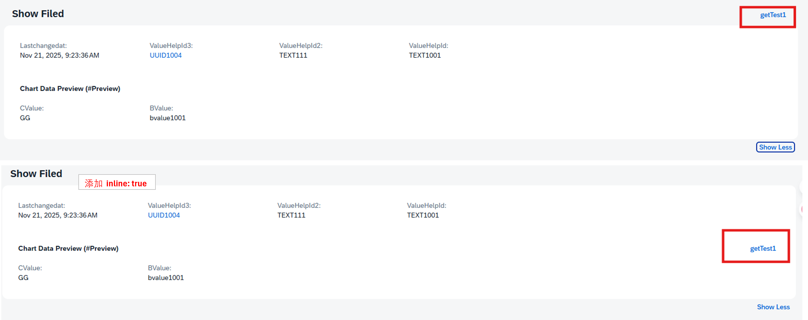
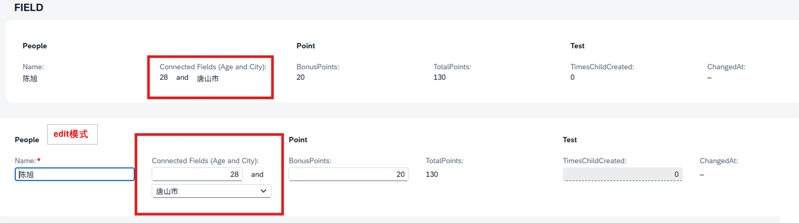

# **目录**
- [**目录**](#目录)
- [基本语法](#属性详解)
- [属性详解](#基本语法)
- - [@UI.fieldGroup.qualifier](#uifieldgroupqualifier)
- - [@UI.fieldGroup.position](#uifieldgroupposition)
- - 
  

## @UI.fieldGroup 属性详解
@UI.fieldGroup 是 SAP BTP RAP 开发中用于在对象页上将多个相关字段组织在同一区域的注解。通过字段分组，可以提升界面信息密度和可读性，例如将地址信息或产品尺寸等字段归类显示。

核心概念
用途：在 Fiori Elements 对象页中，将相关字段组织成语义化的组，例如将地址相关的多个字段放在一个"地址"组里。

工作机制：通过 @UI.fieldGroup 注解定义字段分组，然后通过 @UI.facet 注解在对象页面上创建对应的显示区域。

布局效果：分组后的字段会在同一区域紧凑排列，减少页面滚动，提升用户体验。


## 基本语法
> 在字段上定义分组
> 
abap
```
@UI.fieldGroup: [{
  position: 10,
  label: 'Product ID',
  qualifier: 'GeneralInfo'
}]
element ProductID;
```

> 在视图头部声明 Facet
> 
abap
```
@UI.facet: [{
  type: #FIELDGROUP_REFERENCE,
  targetElement: 'GeneralInfo',
  label: 'Core Information'
}]
```

## 属性详解
> 与 Facet 的关联仅仅在字段上定义 @UI.fieldGroup 注解，字段还不会在界面上显示。必须通过 @UI.facet 在视图层面声明一个类型为 #FIELDGROUP_REFERENCE 的界面区域，并将它和你创建的字段组绑定，这个组的字段才会在对象页上渲染出来。
> 

#### @UI.fieldGroup.qualifier
> 说明: 字段组的唯一标识符，用于在 Facet 中引用该分组
> 
> 类型: String
> 

abap
```
@UI.fieldGroup: [{
  qualifier: 'AddressInfo',
  position: 10
}]
element Street;
```

#### @UI.fieldGroup.position
> 说明: 字段在组内的显示位置，数字决定排列顺序
> 
> 类型: Integer
> 

abap
```
position: 20  // 数字越小位置越靠前
```

1. 显示与布局属性

@UI.fieldGroup.label
> 说明: 字段在界面中显示的标签文本
> 
> 类型: String
> 

abap
```
label: 'Product Name'
```
#### @UI.fieldGroup.groupLabel
> 说明: 字段组的总标签（如果支持）
> 
> 类型: String
> 

abap
```
groupLabel: 'Contact Information'
```

#### @UI.fieldGroup.hidden

> 说明: 是否隐藏字段（用户可通过个性化设置显示）
> 
> 类型: Boolean
> 
> 取值: true / false
> 

abap
```
hidden: true
```

#### @UI.fieldGroup.exclude
> 说明: 是否从字段组中完全排除此字段
> 
> 类型: Boolean
> 
> 取值: true / false
> 

abap
```
exclude: true
```
#### @UI.fieldGroup.inline
> 说明: 是否内联显示（紧凑布局）
> 
> 类型: Boolean
> 
> 取值: true / false
> 

abap
```
inline: true
```

#### @UI.fieldGroup.emphasized
> 说明: 是否强调显示（通常加粗或高亮）
> 
> 类型: Boolean
> 
> 取值: true / false
> 

abap
```
emphasized: true
```
#### @UI.fieldGroup.cssDefault.width
> 说明: 字段的默认CSS宽度设置
> 
> 类型: String
> 

abap
```
cssDefault: { width: '150px' }
// 或
cssDefault.width: '150px'
```

1. 重要性指示属性
#### @UI.fieldGroup.importance
> 说明: 字段重要性级别，影响显示优先级
> 
> 类型: Enum
> 
> 取值:
> 
> #HIGH - 高重要性
> 
> #MEDIUM - 中等重要性
> 
> #LOW - 低重要性
> 

abap
```
importance: #HIGH
```

#### @UI.fieldGroup.criticality
> 说明: 关键性状态指示
> 
> 类型: Enum
> 
> 取值:
> 
> #CRITICAL / #ERROR - 错误/关键
> 
> #WARNING - 警告
> 
> #SUCCESS - 成功
> 
> #INFORMATION - 信息
> 
> #NONE - 无
> 

abap
```
criticality: #WARNING
```

#### @UI.fieldGroup.criticalityRepresentation
> 说明: 关键性状态的视觉表示方式
> 
> 类型: Enum
> 
> 取值:
> 
> #WITH_ICON - 带图标显示
> 
> #WITHOUT_ICON - 仅颜色指示
> 
> #WITH_TEXT - 带文本说明
> 
abap
```
criticalityRepresentation: #WITH_ICON
```

4. 交互行为属性
#### @UI.fieldGroup.type
> 说明: 字段类型定义
> 
> 类型: Enum
>
> 取值:
>
> #STANDARD - 标准字段
>
> #WITH_URL - 带链接的字段
>
> #WITH_INTENT - 带意图的字段
>
> #FOR_ACTION - 操作字段
>
> #AS_CONNECTED_FIELDS - 连接字符
> 
> 等

###### FOR_ACTION
metadata
```
 @UI:{
     fieldGroup: [
       {
          qualifier: 'chartDataPreview',
          position: 10
       },
       {
           position: 20,
           qualifier: 'chartDataPreview',
           type:#FOR_ACTION,
           dataAction: 'getTest1',
           label:'getTest1'
             
       }
     ]
   }
  @EndUserText.label : 'BValue'
  BValue;
```



###### AS_CONNECTED_FIELDS
> 可以使多个字段共用一个label起到连接字符作用
> 
metadata
> 这边简单使 age字段和city字段连接
>
> 这边用到了type: #AS_CONNECTED_FIELDS 配合 connectedFields 可以连接字符
```
@UI:{
    lineItem: [{ position: 30,label: 'Age' }],
    connectedFields: [
    {
      qualifier: 'ConnectedFields',
      name: 'Age'
    }]
}
@EndUserText.label : 'Age'
Age;

@UI:{
    connectedFields: [
    {
      qualifier: 'ConnectedFields',
      groupLabel: 'Connected Fields (Age and City)',
      name: 'City',
      template: '{Age} and {City}'
    }
    ],
    fieldGroup: [
      {
          qualifier: 'people',
          type: #AS_CONNECTED_FIELDS,
          valueQualifier: 'ConnectedFields',
          position: 40
      }
    ],
  textArrangement: #TEXT_ONLY
}
@EndUserText.label : 'City'
City;
```




#### @UI.fieldGroup.dataAction
> 说明: 关联的数据操作ID，需在Behavior中定义
> 
> 类型: String
> 
abap
```
dataAction: 'approveRequest'
```

#### @UI.fieldGroup.determining
> 说明: 是否为决定性字段（影响其他字段显示或行为）
> 
> 类型: Boolean
> 
> 取值: true / false
> 

abap
```
determining: true
```

#### @UI.fieldGroup.actionGroupId

> 说明: 关联的操作组ID，用于分组相关操作
> 
> 类型: String
> 
abap
```
actionGroupId: 'qualityCheckActions'
```
#### @UI.fieldGroup.isCopyAction
> 说明: 是否为复制操作字段
> 
> 类型: Boolean
> 
> 取值: true / false
> 
abap
```
isCopyAction: true
```
#### @UI.fieldGroup.navigationAvailable
> 说明: 是否可用导航
> 
> 类型: Boolean
> 
> 取值: true / false
> 
abap
```
navigationAvailable: true
```

#### @UI.fieldGroup.requiresContext
> 说明: 操作是否需要上下文信息
>
> 类型: Boolean
> 
> 取值: true / false
> 

abap
```
requiresContext: true
```

#### @UI.fieldGroup.invocationGrouping
> 说明: 操作调用的分组方式
> 
> 类型: Enum
> 
> 取值:
>
> #ISOLATED - 独立调用
>
> #CHANGE_SET - 分组调用
> 

abap
```
invocationGrouping: #CHANGE_SET
```

5. 语义导航属性
#### @UI.fieldGroup.semanticObject
> 说明: 语义对象名称，用于跨应用导航
> 
> 类型: String
> 

abap
```
semanticObject: 'Product'
```

#### @UI.fieldGroup.semanticObjectAction
> 说明: 语义对象关联的操作
> 
> 类型: String
> 

abap
```
semanticObjectAction: 'display'
```

#### @UI.fieldGroup.semanticObjectBinding.element
> 说明: 语义对象绑定的元素名称
> 
> 类型: String
> 

abap
```
semanticObjectBinding: { element: 'ProductID' }
```

#### @UI.fieldGroup.semanticObjectBinding.localElement
> 说明: 语义对象绑定的本地元素名称
> 
> 类型: String
> 

abap
```
semanticObjectBinding: { localElement: 'localProductID' }
```

#### @UI.fieldGroup.semanticObjectBinding.localParameter
> 说明: 语义对象绑定的本地参数名称
>
> 类型: String
> 

abap
```
semanticObjectBinding: { localParameter: 'productParam' }
```

6. 内容显示属性
#### @UI.fieldGroup.value
> 说明: 显示的字段值（可用于静态值或计算值）
> 
> 类型: String
> 

abap
```
value: 'Completed'
```

#### @UI.fieldGroup.valueQualifier
> 说明: 值限定符，如货币、单位等
> 
> 类型: String
> 

abap
```
valueQualifier: 'EUR'
```

#### @UI.fieldGroup.url
> 说明: 链接URL（当type为#WITH_URL时使用）
> 
> 类型: String
> 

abap
```
url: 'https://example.com/details'
```

#### @UI.fieldGroup.iconUrl
> 说明: 字段旁显示的图标URL
> 
> 类型: String
> 

abap
```
iconUrl: 'sap-icon://alert'
```

#### @UI.fieldGroup.targetElement
> 说明: 目标元素名称，用于导航或关联
> 
> 类型: String
> 

abap
```
targetElement: 'ProductDetails'
```

7. 高级功能属性
#### @UI.fieldGroup.rowSpanForDuplicateValues
> 说明: 相同值是否合并单元格显示
> 
> 类型: Boolean
> 
> 取值: true / false
> 

abap
```
rowSpanForDuplicateValues: true
```

#### @UI.fieldGroup.isPartOfPreview
> 说明: 是否包含在预览中
> 
> 类型: Boolean
> 
> 取值: true / false
> 

abap
```
isPartOfPreview: true
```