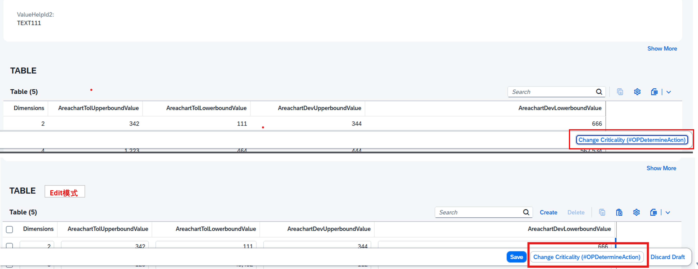
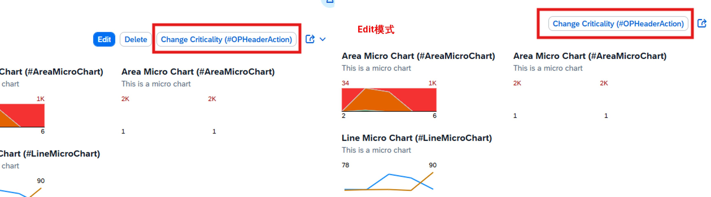

## **@UI.identification属性详解**
@UI.identification 是 SAP BTP RAP 开发中用于定义对象页面标识区域(头部区域)字段显示属性和行为的注解。与Facet的关联：仅仅在字段上定义@UI.identification注解，字段还不会在界面上显示。必须通过 @UI.facet 在视图层面声明一个类型为 #IDENTIFICATION_REFERENCE 的界面区域，并将它和你创建的字段组绑定，这个组的字段才会在对象页上渲染出来。以下是各个属性的详细说明：

#### a，基本显示属性

> qualifier: 限定符，用于区分同名字段
> 
> position: 字段在标识区域中的位置(数字决定显示顺序)
> 
> actionGroupId: 关联的操作组ID
> 
> exclude: true/false - 是否从标识区域排除此字段
> 
> hidden: true/false - 是否隐藏此字段(用户可通过个性化设置显示)
> 
> inline: true/false - 是否内联显示(紧凑布局)
> 
> [determining: true/false](#for_action-and-determining) - 是否为决定性字段(影响其他字段显示)
> 
> > importance: 重要性级别：
> > 
> >  #HIGH - 高重要性
> > 
> >  #MEDIUM - 中等重要性
> > 
> >  #LOW - 低重要性
> emphasized: true/false - 是否强调显示(通常加粗或高亮)
> 
> rowSpanForDuplicateValues: true/false - 相同值是否合并单元格显示
> 
> isPartOfPreview: true/false - 是否包含在预览中
> 
> cssDefault: 默认CSS样式
> 
> width: 宽度设置(如'100px'或'10rem')

#### c，字段类型与内容
> type: 字段类型，常用值：
> 
> #STANDARD - 标准字段
> 
> #WITH_URL - 带链接的字段
> 
> #WITH_INTENT - 带意图的字段
> 
> [#FOR_ACTION](#for_action-and-determining) - 操作字段
> 
> label: 字段标签文本
> 
> iconUrl: 字段旁显示的图标URL(如'sap-icon://alert')
> 
> criticality : 危急程度
> 
> criticalityRepresentation: 关键性表示方式：
> 
> #WITH_ICON - 带图标
> 
> #WITHOUT_ICON - 仅颜色
> 
> #WITH_TEXT - 带文本

#### d，行为与交互
> dataAction: 关联的数据操作ID
> 
> isCopyAction: true/false - 是否为复制操作
> 
> navigationAvailable: true/false - 是否可用导航
> 
> requiresContext: true/false - 是否需要上下文
> 
> invocationGrouping: 调用分组方式：
> 
> #ISOLATED - 独立
> 
> #GROUPED - 分组

#### e，语义对象与导航
> semanticObject: 语义对象名称(用于导航)
> 
> semanticObjectAction: 语义对象动作
> 
> semanticObjectBinding: 语义对象绑定配置
> 
> localParameter: 本地参数名
> 
> localElement: 本地元素名
> 
> element: 元素名

#### f，值显示
> value: 显示的字段值
> 
> valueQualifier: 值限定符(如货币单位)
> 
> targetElement: 目标元素(用于导航)
> 
> url: 链接URL(当type为#WITH_URL时使用)


## 例

#### #FOR_ACTION and determining
> 这里用了determining: true 所以按钮会显示在OverflowToolbar中 
>
> dataAction: 'changeCriticality'中的changeCriticality还需在[Behavior](../Behavior/Behavior.md)中的action设定
```
@UI.identification: [
    {
        type: #FOR_ACTION,
        label: 'Change Criticality (#OPDetermineAction)',
        dataAction: 'changeCriticality',
        determining: true 
    }
] 
```


> 由于没有使用determining: true 按钮会显示在Header
```
@UI.identification: [
    {
        type: #FOR_ACTION,  //Action in the RootEntities of the object page next to the edit button
        label: 'Change Criticality (#OPHeaderAction)',
        dataAction: 'changeCriticality'
    }
] 
```
