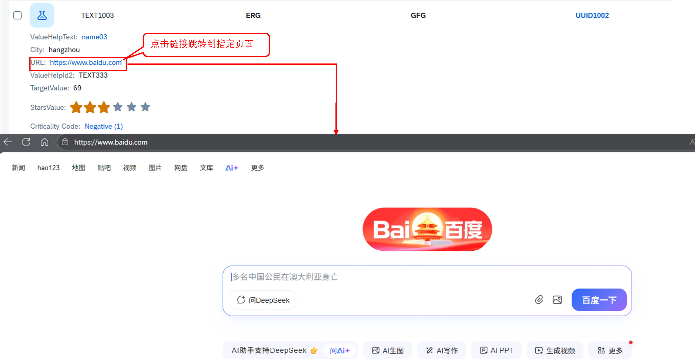
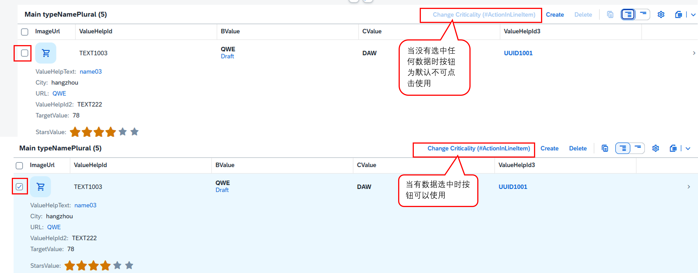
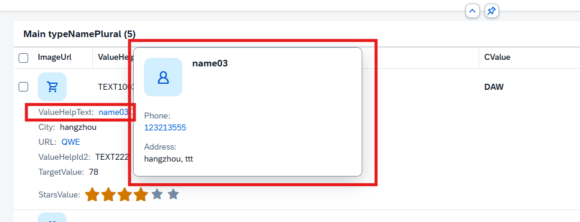
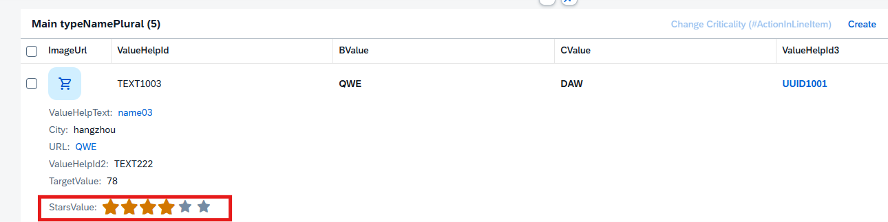
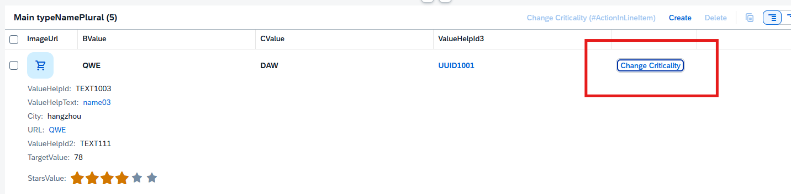

### **2-1，@UI.lineItem Annotation 属性详解**

@UI.lineItem 是 SAP BTP RAP 开发中用于定义列表页(line item table)中列的显示属性和行为的注解。以下是各个属性的详细说明：

#### **目录**
- [a，基本显示属性](#a基本显示属性)
- [b，样式控制](#b样式控制)
- [c，列类型与内容](#c列类型与内容)
- [d，行为与交互](#d行为与交互)
- [e，语义对象与导航](#e语义对象与导航)


#### **a，基本显示属性**

> qualifier: 限定符，用于区分同名字段
> 
> position: 列在表格中的位置(数字，决定显示顺序)
> 
> actionGroupId: 关联的操作组ID
> 
> exclude: true/false - 是否从列表中排除此列
> 
> hidden: true/false - 是否隐藏此列(用户可通过个性化设置显示)
> 
> inline: true/false - 是否内联显示(通常用于紧凑布局)
> 
> determining: true/false - 是否为决定性字段(影响其他字段显示)
> 
> importance: #HIGH/#MEDIUM/#LOW - 列的重要性级别
> 
> emphasized: true/false - 是否强调显示(通常加粗或高亮)
> 
> rowSpanForDuplicateValues: true/false - 相同值是否合并单元格显示
> 
> isPartOfPreview: true/false - 是否包含在预览中


#### **b，样式控制**

> cssDefault: 默认CSS样式
> 
> width: 列宽度(如'100px'或'10rem')


#### **c，列类型与内容**

> type: 列类型，常用值：
> 
> \#STANDARD - 标准列
> 
> [#WITH_URL](#with_url) - 带链接的列
> 
> \#WITH\_INTENT\_BASED\_NAVIGATION - 带意图的列
> 
> [#FOR_ACTION](#for_action) - 操作列
> 
> \#FOR\_INTENT\_BASED\_NAVIGATION - 基于意图导航的列
> 
> [#AS_CONTACT](#as_contact)
> 
> \#AS\_ADDRESS
> 
> [#AS_DATAPOINT](#as_datapoint)
> 
> label: 列标题文本
> 
> iconUrl: 列标题旁显示的图标URL(如'sap-icon://alert')
> 
> criticality: 关键性指示：
> 
> \#CRITICAL/#ERROR - 错误/关键
> 
> \#WARNING - 警告
> 
> \#SUCCESS - 成功
> 
> \#INFORMATION - 信息
> 
> \#NONE - 无
> 
> criticalityRepresentation: 关键性表示方式：
> 
> \#WITH\_ICON - 带图标
> 
> \#WITHOUT\_ICON - 仅颜色
> 
> \#WITH\_TEXT - 带文本


#### **d，行为与交互**

> dataAction: 关联的数据操作ID
> 
> isCopyAction: true/false - 是否为复制操作
> 
> navigationAvailable: true/false - 是否可用导航
> 
> requiresContext: true/false - 是否需要上下文
> 
> invocationGrouping: 调用分组方式：
> 
> \#ISOLATED - 独立
> 
> \#GROUPED - 分组


#### **e，语义对象与导航**

> semanticObject: 语义对象名称(用于导航)
> 
> semanticObjectAction: 语义对象动作
> 
> semanticObjectBinding: 语义对象绑定配置
> 
> localParameter: 本地参数名
> 
> localElement: 本地元素名
> 
> element: 元素名


#### **f，值显示**

> value: 显示的字段值
> 
> valueQualifier: 值限定符(如货币单位)
> 
> targetElement: 目标元素(用于导航)
> 
> url: 链接URL(当type为#WITH\_URL时使用)


#### **实际应用示例**
```
@UI.lineItem: [{
   position: 10,
   label: 'Order ID',
   type: #STANDARD,
   emphasized: true,
   importance: #HIGH,
   width: '100px'
}, {
   position: 20,
   label: 'Customer',
   type: #WITH_URL,
   url: '/Customer/{CustomerID}',
   criticality: #INFORMATION,
   criticalityRepresentation: #WITH_ICON
}, {
   position: 30,
   label: 'Status',
   type: #STANDARD,
   criticality: {
     path: 'OverallStatus',
     criticalityRepresentation: #WITH_ICON,
     values: {
       'C': #CRITICAL,
       'P': #WARNING,
       'D': #SUCCESS
     }
   }
}]
```


## #WITH_URL
> 生成链接需要在type选择#WITH_URL还要url中加入链接字段如示例中的AValue字段类型为char
```
@UI:{
   lineItem:[
   {
      label:'URL',
      url:'AValue',
      type:#WITH_URL,
      position: 20
   }
   ]
}
AValue;
```



## #FOR_ACTION
> 实现按钮功能需要用到type:#FOR_ACTION和dataAction: 'changeCriticality' 还要在behavior加入action changeCriticality，具体按钮功能需要在
> classes中去编写
> 
cds
```
@UI:{
   lineItem: [{ position: 200,
      type:#FOR_ACTION,
      label: 'Change Criticality (#ActionInLineItem)',
      dataAction: 'changeCriticality' 
      }],
   selectionField: [{ position: 40 }],
   fieldGroup: [
      {
      qualifier: 'ShowWhenInEdit',
      label:'Criticality'
      },
      { 
      qualifier: 'HeaderData',
      criticality: 'Criticality',
      position: 50,
      label: 'Criticality QuickView(#QuickViewNullValueIndicator)'
   }] 
}
Criticality;
```

behavior
```
  action  changeCriticality parameter YCX_D_ChangeCriticalityP result [1] $self;
```


## #AS_CONTACT
> 要出实现弹窗功能需要使用type: #AS_CONTACT，value:'_ValueHelp',还需要在其关联的弹窗cds中设置@Semantics等这边请看
> [@UI.facet Annotation 属性详解中#QUICK_VIEW这部分](<../@UI.facet/@UI.facet Annotation 属性详解.md>)
```
@UI:{
   lineItem:[
   {  
      position: 10,
      label:'ValueHelpId'
   },
   {
      type: #AS_CONTACT,
      value:'_ValueHelp',
      position: 15,
      label:'ValueHelpText'
      },
      {
      value:'_ValueHelp.City',
      position: 17,
      label:'City'
      
      }
   ],
   fieldGroup: [
      {
         qualifier: 'HeaderData',
         position: 10,
         label: 'ValueHelp',
         type:#AS_CONTACT,
         value:'_ValueHelp'
      }
   ],
   textArrangement: #TEXT_ONLY
}
ValueHelpId;
```



## #AS_DATAPOINT
> 这里需要用到 type:#AS_DATAPOINT,还需要对@UI.dataPoint进行设置
```
   @UI:{
      dataPoint: {
      qualifier: 'StarsValue',
      targetValue: 6,
      visualization: #RATING,
      title: 'Rating Indicator (#DataPointRating)'
      },
      lineItem: [
      {
         type:#AS_DATAPOINT,
         label: 'StarsValue',
         importance: #LOW,
         position: 90
      }
      ],
      fieldGroup: [{
         qualifier: 'ShowWhenInEdit',
         type: #AS_DATAPOINT,
         label: 'Edit Rating Indicator'
      }]
   }
   StarsValue;
```



## inline
```
@UI:{
   lineItem: [
      {
      type:#FOR_ACTION,
      label: 'Change Criticality',
      dataAction: 'changeCriticality',
      inline: true,
      emphasized: true,
      importance: #HIGH,
      position: 100
      }
   ]
}
Criticality;
```



[回到顶部](#)