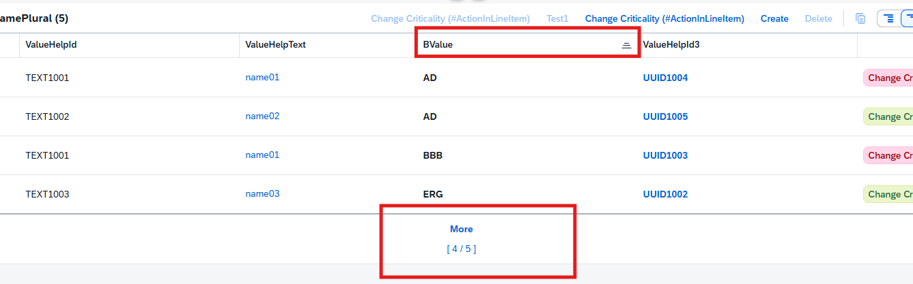

## @UI.presentationVariant
> maxItems: 4 - 显示最大行数，这里数据为五条显示最大行数为四条
>
> sortOrder - 给字段加入排序功能，by: 'BValue'这里设置字段为BValue,设置为升序（direction: #ASC）
```
@UI.presentationVariant: [
  {
    qualifier: 'pVariant',
    text: '(#PresentationVariant)',
    maxItems: 4,
    sortOrder: [
      {
        by: 'BValue',
        direction: #ASC
      }
    ],
    visualizations: [{type: #AS_LINEITEM}]
  }
]
```
