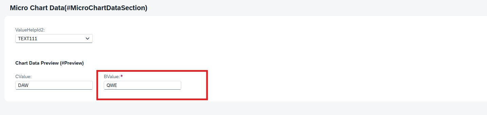
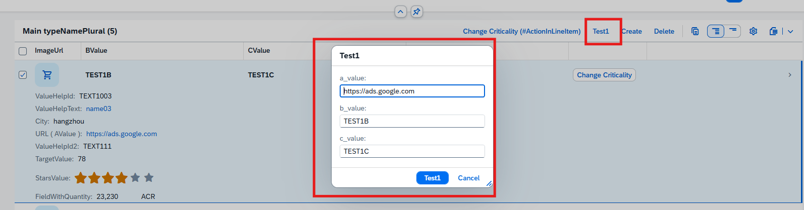

## **目录**
- [**目录**](#目录)
- [field](#field)
- [field(mandatory)](#fieldmandatory)
- [field(features:instance)](#fieldfeaturesinstance)
- [field(mandatory:create)](#fieldmandatorycreate)
- [action](#action)
    - [static action](#static-action)
    - [Factory Action](#factory-action)
- [side effects](#side-effects)
- [validation](#validation)
- [determination](#determination)
- [default function GetDefaultsFor](#default-function-getdefaultsfor)
- [例](#例)


## field

> field(readonly) Field1, Field2 - 只读字段
>
> field(mandatory) Field1, Field2 - 必填字段
>
> field(suppress) Field1, Field2 
>
> [field(features:instance) Field1, Field2](#fieldfeaturesinstance) - features:instance会限制访问字段
>
> [field(mandatory:create) Field1, Field2](#fieldmandatorycreate) - 在创建实例时必须输入值
>
> field(readonly:update) Field1, Field2 - 在更新状态时为只读，也就是说创建之后就不会更改
>
> field ( readonly, numbering: managed ) Field1 - numbering: managed 自动生成随机十六位uuid   


## field(mandatory)
> 在对应字段上写fieldGroup会生成带有星号的必填字段
Behavior
```
field (mandatory) BValue;
```


## field(features:instance)
Behavior
```
field ( features : instance ) AValue;
```

Classes
```
CLASS lhc_YCX_R_MAINSHOW DEFINITION INHERITING FROM cl_abap_behavior_handler.
  PRIVATE SECTION.

  METHODS get_instance_features FOR INSTANCE FEATURES
  IMPORTING keys REQUEST requested_features FOR YCX_R_MAINSHOW RESULT result.

ENDCLASS.

CLASS lhc_YCX_R_MAINSHOW IMPLEMENTATION.

  METHOD get_instance_features.
    //内部可写后续逻辑
  ENDMETHOD.

ENDCLASS.
```


## field(mandatory:create)
> 点击Create按钮后会生成弹窗,用@EndUserText.label : 'BValue'设置label
> 
Behavior
```
field (mandatory : create) BValue;
```


## action
> 如果要一次创建操作多条数据，就得用上action，或者创建前的各种逻辑校验，如果需要返回值的时候也会需要action
>
Behavior
```
action getTest1 parameter YCX_D_ActionParam_Test_0001 result [1] $self;
```


YCX_D_ActionParam_Test_0001
```
@EndUserText.label: 'YCX_D_ActionParam_Test_0001'
define abstract entity YCX_D_ActionParam_Test_0001
{
    @UI.defaultValue: #( 'ELEMENT_OF_REFERENCED_ENTITY: AValue' )
    a_value: abap.char( 256 );
    @UI.defaultValue: #( 'ELEMENT_OF_REFERENCED_ENTITY: BValue' )
    b_value: abap.char( 256 );
    @UI.defaultValue: #( 'ELEMENT_OF_REFERENCED_ENTITY: CValue' )
    c_value: abap.char( 256 );
    
}

```
classes
```
METHOD getTest1.
  TYPES: tt_abc_value    TYPE STANDARD TABLE OF ycxmaintable WITH DEFAULT KEY.
      DATA(lt_abc_value) = VALUE tt_abc_value( ).
    SELECT *
    FROM ycxmaintable
    INTO TABLE @lt_abc_value.


  MODIFY ENTITIES OF YCX_R_MAINSHOW IN LOCAL MODE
    ENTITY YCX_R_MAINSHOW
      UPDATE
        FIELDS ( AValue BValue CValue )
        WITH VALUE #( FOR key IN keys
                        ( %tky                  = key-%tky
                          AValue       = key-%param-a_value
                          BValue       = key-%param-b_value
                          CValue       = key-%param-c_value

                          ) )
    FAILED failed
    REPORTED reported.

    READ ENTITIES OF YCX_R_MAINSHOW IN LOCAL MODE
    ENTITY YCX_R_MAINSHOW
      ALL FIELDS WITH CORRESPONDING #( keys )
    RESULT DATA(roots).

  result = VALUE #( FOR root IN roots
                      ( %tky   = root-%tky
                        %param = root ) ).
ENDMETHOD.
```



#### static action

> static action 需要用到 authorization : global 不加也可以会有警告
>
> static action 始终处于活动状态，因为它会影响整个对象，并且不依赖于选定的数据记录。static action 与action 也相应不同，因为在这里我们必须自己从数据库中读取所有密钥，而不是被移交。
> 
Behavior
```
  static action ( authorization : global ) staticAction;
```

> 下面功能是找到数据中的 Name 值为 陈旭 的数据，并清除对应 city 上的值，还有些问题点击按钮后得刷新之后才能看到city清除数据效果
> 
Classes
```
METHOD staticAction.

    DATA : lt_peoples TYPE TABLE OF ycxcreatedata.

    SELECT FROM ycxcreatedata
      FIELDS City ,Id
      WHERE Name = '陈旭'
      INTO TABLE @DATA(lt_peoples_data).

    LOOP AT lt_peoples_data INTO DATA(ls_people).
      MODIFY ENTITIES OF ycx_test001_data IN LOCAL MODE
        ENTITY ycx_test001_data
        UPDATE FIELDS ( City  )
        WITH VALUE #( ( Id = ls_people-id  City = ''
*          %control-City = if_abap_behv=>mk-on
        ) ).
    ENDLOOP.

    INSERT VALUE #(
      %msg = new_message_with_text( text = |{ lines( lt_peoples_data ) } 条数据 Name 的值为 陈旭 并且清除 City 值|
      severity = if_abap_behv_message=>severity-success )
    ) INTO TABLE reported-ycx_test001_data.

ENDMETHOD.
```


#### Factory Action
> Factory Action没有返回值
>
> 下面代码功能是点击按钮复制选中数据
> 
Behavior
```
factory action copyData[1];
```
> %is_draft使用后点击按钮直接进入edit模式
>
> CORRESPONDING #() - 可以使抽取的项目一一对应到设置好的内表
> 
> EXCEPT - 除了
>
> 属性 %data 自身就表明了要创建的数据的传输

Classes
```
METHOD copyData.
  DATA: lt_people TYPE TABLE FOR CREATE ycx_test001_data.

  READ ENTITIES OF ycx_test001_data IN LOCAL MODE
    ENTITY ycx_test001_data
      ALL FIELDS WITH CORRESPONDING #( keys )
      RESULT DATA(peoples)
      FAILED failed.

  LOOP AT peoples ASSIGNING FIELD-SYMBOL(<lfs_peoples>).
      APPEND VALUE #( %cid = keys[ KEY entity %key = <lfs_peoples>-%key ]-%cid
                      %is_draft = keys[ KEY entity %key = <lfs_peoples>-%key ]-%param-%is_draft   
                      %data     = CORRESPONDING #( <lfs_peoples> EXCEPT id )                     
      ) TO lt_people .
  ENDLOOP.


// 使用 MODIFY 设置新的记录映射（MAPPED）到表中
  MODIFY ENTITIES OF ycx_test001_data IN LOCAL MODE
  ENTITY ycx_test001_data
  CREATE FIELDS ( Age ChangedAt ChangedBy City Name  )
  WITH lt_people
  MAPPED DATA(mapped_create).

  mapped-ycx_test001_data = mapped_create-ycx_test001_data.

ENDMETHOD.
```


## side effects
[side effects](<../side effects.md>)

## validation 


## determination
[text](../determination.md)


## default function GetDefaultsFor 
>  默认值函数的名称需要以 GetDefaultsFor 开头
```
// Create operations (name can be omitted):
create { default function; }

// Create-by-association-operations:
association _Item { with draft; create { default function GetDefaultsForCBA external 'GetDefaultsForCreateByAssociation'; } }

//Actions:
action PlainAction parameter myPlainParameter { default function GetDefaultsForPlainAct; }

//Functions:
function DeepFunction deep parameter myDeepParameter result [0..*] MyEntity { default function GetDefaultsForDeepFct; }

```

## 例
```
managed implementation in class zbp_cx_r_mainshow unique;
strict ( 2 );
with draft;

define behavior for YCX_R_MAINSHOW //alias <alias_name>
persistent table ycxmaintable
draft table ycxmaintable_d
lock master
total etag Createdby
authorization master ( instance )
etag master Createdby
{
  create ( authorization : global );
  update;
  delete;
  field ( readonly ) Id;
  field ( features : instance ) AValue;
  association _Chart { with draft;create; }
  association _Child { with draft;create; }

  draft action Resume;
  draft action Edit;
  draft action Activate optimized;
  draft action Discard;
  draft determine action Prepare{}

  action  changeCriticality parameter YCX_D_ChangeCriticalityP result [1] $self;
//    side effects
//    {
//        action changeCriticality affects field Criticality;
//    }

    mapping for ycxmaintable
    {
        FieldWithQuantity = field_with_quantity;
        Uom = uom;
        StarsValue = stars_value;
        FieldWithCriticality = field_with_criticality;
        Criticality = criticality;
        ImageUrl = image_url;
        Id = id;
        ValueHelpId = valuehelp_id;
        ValueHelpId2 = valuehelp2_id;
        ValueHelpId3 = valuehelp4_id;
        AValue = a_value;
        BValue = b_value;
        CValue = c_value;
        IntegerValueForLineChart = integer_value_for_line_chart;
        TargetValue = target_value;
        Createdby = createdby;
        Createdat = createdat;
        Locallastchangedby = locallastchangedby;
        Locallastchangedat = locallastchangedat;
        Lastchangedat = lastchangedat;
        Dimensions = dimensions;
        AreachartTolUpperboundValue = areachart_tol_upperbound_value;
        AreachartTolLowerboundValue = areachart_tol_lowerbound_value;
        AreachartDevUpperboundValue = areachart_dev_upperbound_value;
        AreachartDevLowerboundValue = areachart_dev_lowerbound_value;
    }
}

define behavior for YCX_R_CHART //alias <alias_name>
persistent table ycxchart
draft table ycxchart_d
lock dependent by _Main
authorization dependent by _Main
etag master Id
{
  update;
  delete;
  field ( readonly ) Id;
  field (readonly) ParentId;
  association _Main{with draft;}

   mapping for ycxchart
    {
        Id = id;
        ParentId = parent_id;
        IntegerValueForLineChart = integer_value_for_line_chart;
        TargetValue = target_value;
        Dimensions = dimensions;
        AreachartTolUpperboundValue = areachart_tol_upperbound_value;
        AreachartTolLowerboundValue = areachart_tol_lowerbound_value;
        AreachartDevUpperboundValue = areachart_dev_upperbound_value;
        AreachartDevLowerboundValue = areachart_dev_lowerbound_value;

    }
}

define behavior for YCX_R_CHILD2 //alias <alias_name>
persistent table ycxchild
draft table ycxchild_d
lock dependent by _Main
authorization dependent by _Main
etag master Id
{
  update;
  delete;
  field ( readonly, numbering: managed   )Id;
  field (readonly) ParentId;
  association _Main{with draft;}

   mapping for ycxchild corresponding{
    BooleanProperty = boolean_property;
    CriticalityCode = criticality_code;
    FieldWithPercent = field_with_percent;
    ParentID = parent_id;
    StringProperty = string_property;
    StreamFile = stream_file;
    StreamFilename = stream_filename;
    StreamMimeType = stream_mimetype;
    ChildPieces = child_pieces;
    StreamIsReadOnly = stream_is_readonly;
  }

}
```

[回到顶部](#)