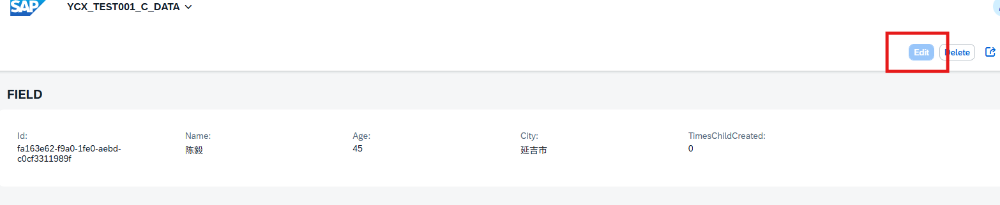
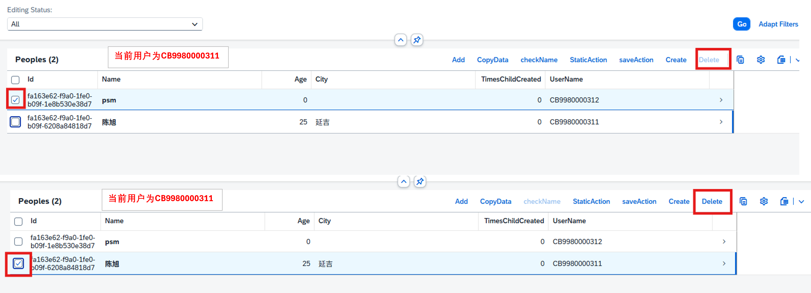
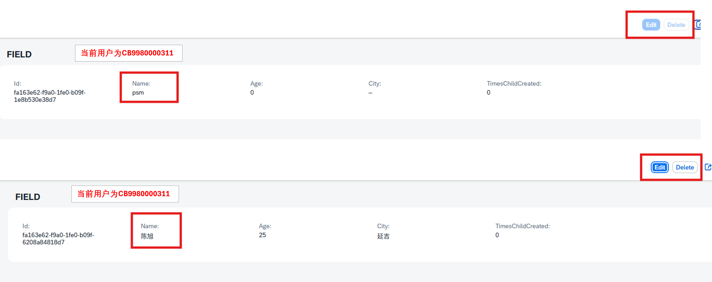
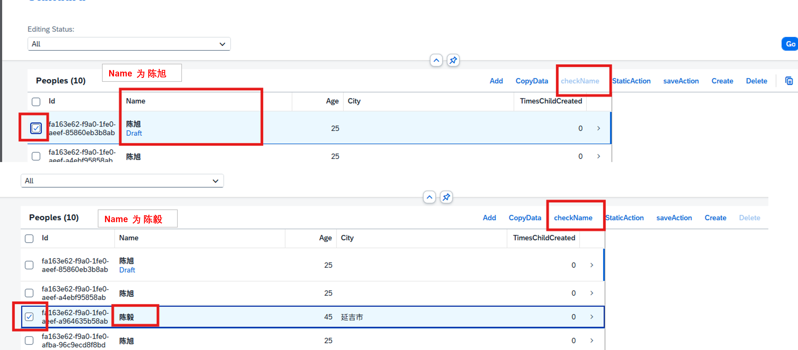
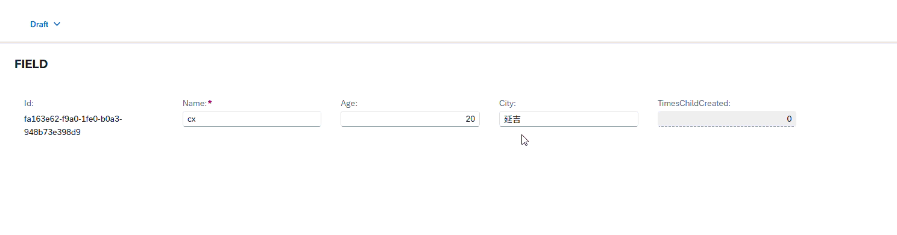
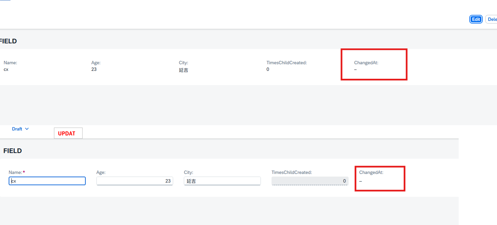
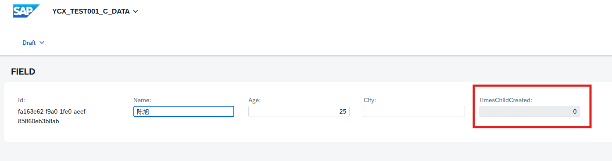
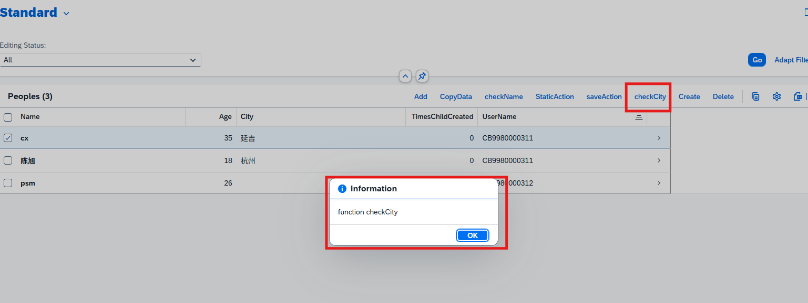

## **目录**
- [**目录**](#目录)
- [draft table](#draft-table)
- [with draft](#with-draft)
- [implementation in class zbp\_cx\_r\_xxxx unique](#implementation-in-class-zbp_cx_r_xxxx-unique)
- [etag master LocalLastChangedAt;](#etag-master-locallastchangedat)
- [authorization （授权）](#authorization-授权)
    - [authorization : global （全局授权）](#authorization--global-全局授权)
    - [authorization : instance](#authorization--instance)
- [features](#features)
    - [features : instance](#features--instance)
    - [features : global](#features--global)
- [执行顺序](#执行顺序)
- [precheck](#precheck)
- [field](#field)
    - [field(suppress)](#fieldsuppress)
    - [field(mandatory)](#fieldmandatory)
    - [field(features:instance)](#fieldfeaturesinstance)
    - [field(mandatory:create)](#fieldmandatorycreate)
- [function](#function)
    - [default function GetDefaultsForChild;](#default-function-getdefaultsforchild)
- [action](#action)
    - [static action](#static-action)
    - [Factory Action](#factory-action)
- [action and function](#action-and-function)
- [side effects](#side-effects)
- [validation](#validation)
- [determination](#determination)
- [default function GetDefaultsFor](#default-function-getdefaultsfor)
- [例](#例)

## draft table
>  RAP ABAP 中的草稿表允许您在事务处理期间临时保存不完整或中间的用户输入。此草稿数据与最终的持久业务数据分开存储，确保用户可以逐步处理其更改，而无需立即将其提交到数据库中。用户可以稍后检索、修改和完成草稿。

## with draft
>  用于启用 draft 功能
>

还需要用到以下

|Draft Action	        |Meaning	|
|---------------|-----------------------------------------|
|draft action Edit;	|将持久化表（persistent table）中的内容复制到草稿表（draft table）。|
|draft action Activate;	|将草图数据库表的内容复制到持久数据库表，并清除草稿数据库表|
|draft action Discard;	|清除草稿数据库表中的所有条目	|
|draft action Resume; 	    |在持久数据库表上为实体实例设置锁|
|draft determine action Prepare;	    |最终确定操作允许消费者执行最终确定(determination)和验证(validation)。草稿确定操作是其对应的草稿版功能。|

## implementation in class zbp_cx_r_xxxx unique
> 此声明指明了可实现额外判定和验证的实现类。在非托管环境( unmanaged )中，该类会执行所有操作。
> 
> 可以写在managed ，也可写在 define behavior for YCX_R_MAINSHOW 下面
> 
```
managed implementation in class zbp_cx_r_mainshow unique;
strict ( 2 );
with draft;

define behavior for YCX_R_MAINSHOW //alias <alias_name>
persistent table ycxmaintable
draft table ycxmaintable_d
lock master
total etag Createdby
authorization master ( instance )
etag master Createdby
{
  create ( authorization : global );
  update;
  delete;
  field ( readonly ) Id;
  field ( features : instance ) AValue;

  association _Chart { with draft;create; }

  draft action Resume;
  draft action Edit;
  draft action Activate optimized;
  draft action Discard;
  draft determine action Prepare{}

  ...
}

define behavior for YCX_R_CHART //alias <alias_name>

implementation in class zbp_cx_r_char unique

persistent table ycxchart
draft table ycxchart_d
lock dependent by _Main
authorization dependent by _Main
etag master Id
{
  update;
  delete;
  field ( readonly ) Id;
  field (readonly) ParentId;
  association _Main{with draft;}
  ...

}
```
[回到顶部](#)

## etag master LocalLastChangedAt;
> 定义实体为 ETag 主实体，并指定负责变更日志记录的字段。依赖实体也可通过 _Assoc 关联成为 ETag 依赖实体。

## authorization （授权）
> global :对整个 RAP BO 的数据访问权限或执行某些操作的权限进行限制，这一限制不受单个实例的影响，而是依据用户角色来确定。可以为以下实体操作指定操作类型：创建、通过关联创建、更新、删除、静态操作、实例操作。
必须在 RAP 处理程序方法中实现全局授权功能FOR GLOBAL AUTHORIZATION。
> 
> instance : 基于实体实例状态的授权检查。
可以针对以下实体操作进行指定：通过关联创建、更新、删除、实例操作。
必须在 RAP 处理程序方法中实现实例授权功能FOR INSTANCE AUTHORIZATION。
> 
> global,instance : 全局授权控制和实例授权控制可以结合起来。在这种情况下，基于实例的操作会在全局授权检查和实例授权检查中进行验证。必须实现 RAP 处理程序方法 FOR GLOBAL AUTHORIZATION 和 FOR INSTANCE AUTHORIZATION。这些检查会在运行时的不同时间点执行。
>
> none: 在依赖授权的实体中执行的操作会被隐式地标记为“授权：无”。如果未指定“无”，则无法为授权实现 RAP 处理程序方法。
[回到顶部](#)

#### authorization : global （全局授权）

Behavior
```
define behavior for YCX_TEST001_DATA //alias <alias_name>
persistent table ycxcreatedata
draft table ycxcreatedata_d
lock master
total etag ChangedBy
authorization master ( global,instance )  //对整体和实例有权限设置
etag master ChangedBy
```

```
{
    create (authorization : global); //只有create有权限上的设置
}
```

Classes
> 下面禁止用户更新和edit按钮
```
  METHOD get_global_authorizations.
    if requested_authorizations-%update = if_abap_behv=>mk-on
    or
    requested_authorizations-%action-edit = if_abap_behv=>mk-on.


*    result-%update = if_abap_behv=>auth-allowed.
*    result-%action-edit = if_abap_behv=>auth-allowed.

    result-%update = if_abap_behv=>auth-unauthorized.
    result-%action-edit = if_abap_behv=>auth-unauthorized.

    ENDIF.


  ENDMETHOD.
```

[回到顶部](#)

#### authorization : instance
Behavior
```
authorization master ( global,instance ) 
```

classes
> 对一些功能设定权限 以下代码功能为一个用户只能改动或者删除自己创建的数据
```
METHOD get_instance_authorizations.

  READ ENTITIES OF ycx_test001_data IN LOCAL MODE
    ENTITY ycx_test001_data
      ALL FIELDS WITH CORRESPONDING #( keys )
      RESULT DATA(peoples)
      FAILED failed.

  result = VALUE #( FOR people IN peoples
                    ( %key = people-%key
                      %delete = COND #( WHEN cl_abap_context_info=>get_user_technical_name( ) = people-UserName
                                                              THEN if_abap_behv=>fc-o-enabled
                                                              ELSE if_abap_behv=>fc-o-disabled
                                                              )
                      %update = COND #( WHEN cl_abap_context_info=>get_user_technical_name(  ) = people-UserName
                                                              THEN if_abap_behv=>mk-on
                                                              ELSE if_abap_behv=>mk-off
                                                              )
                      %action-edit = COND #( WHEN cl_abap_context_info=>get_user_technical_name(  ) = people-UserName
                                                              THEN if_abap_behv=>auth-allowed
                                                              ELSE if_abap_behv=>auth-unauthorized )
                                                              ) ).

ENDMETHOD.
```


[回到顶部](#)


## features

#### features : instance
> 业务对象的操作可以根据特定实例的条件启用或禁用，例如特定字段的值或引用数据的值。例如，如果业务对象实例的状态设置为已归档，则可以通过实例特征控制禁用所有修改操作。在 RAP 处理器方法“FOR INSTANCE FEATURES”中实现是强制性的。

classes
> 检查选中数据 Name 字段值为 陈旭 按钮不被激活反之为按钮为激活状态
> %action-checkName = COND #( WHEN <people>-Name = '陈旭'
                                                          THEN if_abap_behv=>fc-o-disabled
                                                          ELSE if_abap_behv=>fc-o-enabled )
```
METHOD get_instance_features.
  READ ENTITIES OF ycx_test001_data IN LOCAL MODE
    ENTITY ycx_test001_data
      ALL FIELDS WITH CORRESPONDING #( keys )
      RESULT DATA(peoples)
      FAILED failed.

  LOOP AT peoples ASSIGNING FIELD-SYMBOL(<people>).
    APPEND VALUE #( %tky = <people>-%tky
                    %action-checkName = COND #( WHEN <people>-Name = '陈旭'
                                                          THEN if_abap_behv=>fc-o-disabled
                                                          ELSE if_abap_behv=>fc-o-enabled )
                    %field-TimesChildCreated = if_abap_behv=>fc-f-read_only
                                                            ) TO result.
  ENDLOOP.

*    result = VALUE #( FOR people IN peoples
*                      ( %key = people-%key
*                        %features-%action-checkName = COND #( WHEN people-Name = '陈旭'
*                                                              THEN if_abap_behv=>fc-o-disabled
*                                                              ELSE if_abap_behv=>fc-o-enabled )
*                                                              ) ).
ENDMETHOD.
```


[回到顶部](#)

#### features : global
> 业务对象的操作可以全局启用或禁用。这意味着，该决定与单个实体实例的状态无关。例如，可以通过解释功能切换状态来全局启用或禁用某个操作。在 RAP 处理器方法“FOR GLOBAL FEATURES”中实现是强制性的。
>
> 注意使用features : global 这意味着我们无法读取选中信息，也就没有key这个参数，我们只能获取全局数据
> 

behavior
```
delete ( features : global );
```

classes
> 当用户为 CHENXU 禁用删除按钮
```
  METHOD get_global_features.
      if requested_features-%delete = if_abap_behv=>mk-on.
      Data(lv_result) = COND #( when cl_abap_context_info=>get_user_alias(  ) = 'CHENXU'
                               then if_abap_behv=>mk-on
                               else if_abap_behv=>mk-off
                                ).

      result-%delete = lv_result.

      ENDIF.

  ENDMETHOD.
```
[回到顶部](#)

## 执行顺序
> 运行顺序从左到右
> get_global_authorizations  get_global_features  get_instance_authorizations  get_instance_features

## precheck 
> precheck （预校验） 预检查用于在数据到达事务缓冲区之前对其进行验证。这可确保及早捕获无效数据，防止在草稿表或事务缓冲区中进行不必要的存储。
> 防止无效数据保存在草稿表或事务缓冲区中，尤其是在启用草稿的应用程序中
> 

behavior
```
  update ( precheck );
```

classes
> 以下代码功能 在更新时预检查字段 Age 是否符合年龄要求
```
METHOD precheck_update.

  LOOP AT entities ASSIGNING FIELD-SYMBOL(<lfs_entity>).

    "检查用户是否更改了字段Age
    CHECK <lfs_entity>-%control-Age = 01.

    READ ENTITIES OF ycx_test001_data IN LOCAL MODE
    ENTITY ycx_test001_data
    FIELDS ( Age )
    WITH VALUE #( ( %key = <lfs_entity>-%key  ) )
    RESULT DATA(lt_peopleAge).

    IF sy-subrc IS INITIAL.

      IF lt_peopleAge IS INITIAL.
        "Create 时
        IF <lfs_entity>-Age >= 18 AND <lfs_entity>-Age <= 24.
          APPEND VALUE #(  %tky =  <lfs_entity>-%tky
                            %msg = new_message_with_text(
                              severity = if_abap_behv_message=>severity-success
                              text = '18岁到24为实习生'
                            )  ) TO reported-ycx_test001_data.
        ELSEIF <lfs_entity>-Age >= 25 AND <lfs_entity>-Age <= 35.
          APPEND VALUE #(  %tky =  <lfs_entity>-%tky
                            %msg = new_message_with_text(
                              severity = if_abap_behv_message=>severity-success
                              text = '25岁到35为正式员工'
                            )  ) TO reported-ycx_test001_data.
        ELSE.
          APPEND VALUE #(  %tky =  <lfs_entity>-%tky ) TO failed-ycx_test001_data.
          APPEND VALUE #(  %tky =  <lfs_entity>-%tky
                            %msg = new_message_with_text(
                              severity = if_abap_behv_message=>severity-error
                              text = '年龄不合要求 要18到35岁'
                            )  ) TO reported-ycx_test001_data.

        ENDIF.

      ELSE.
        Save 时
        READ TABLE lt_peopleAge ASSIGNING FIELD-SYMBOL(<lfs_db_age>) INDEX 1.
        IF sy-subrc IS INITIAL.
          <lfs_db_age>-Age = <lfs_entity>-Age.
        ENDIF.

        IF <lfs_db_age>-Age >= 18 AND <lfs_db_age>-Age <= 24.
          APPEND VALUE #(  %tky =  <lfs_entity>-%tky
                            %msg = new_message_with_text(
                              severity = if_abap_behv_message=>severity-success
                              text = '18岁到24为实习生'
                            )  ) TO reported-ycx_test001_data.
        ELSEIF <lfs_db_age>-Age >= 25 AND <lfs_db_age>-Age <= 35.
          APPEND VALUE #(  %tky =  <lfs_entity>-%tky
                            %msg = new_message_with_text(
                              severity = if_abap_behv_message=>severity-success
                              text = '25岁到35为正式员工'
                            )  ) TO reported-ycx_test001_data.
        ELSE.
          APPEND VALUE #(  %tky =  <lfs_entity>-%tky ) TO failed-ycx_test001_data.
          APPEND VALUE #(  %tky =  <lfs_entity>-%tky
                            %msg = new_message_with_text(
                              severity = if_abap_behv_message=>severity-error
                              text = '年龄不合要求 要18到35岁'
                            )  ) TO reported-ycx_test001_data.

        ENDIF.

      ENDIF.

    ENDIF.

  ENDLOOP.

ENDMETHOD.
```


[回到顶部](#)

## field

> field(readonly) Field1, Field2 - 只读字段
>
> field(mandatory) Field1, Field2 - 必填字段
>
> [field(suppress) Field1, Field2](#fieldsuppress) - 隐藏字段
>
> [field(features:instance) Field1, Field2](#fieldfeaturesinstance) - features:instance会限制访问字段
>
> [field(mandatory:create) Field1, Field2](#fieldmandatorycreate) - 在创建实例时必须输入值
>
> field(readonly:update) Field1, Field2 - 在更新状态时为只读，也就是说创建之后就不会更改
>
> field ( readonly, numbering: managed ) Field1 - numbering: managed 自动生成随机十六位uuid   

[回到顶部](#)

#### field(suppress)
> 字段（抑制）可用于从 BDEF 衍生类型和所有 RAP API 中移除字段。除主键字段、外键字段以及当前 BDEF 使用的字段（如 ETag 字段）外，所有字段均可进行此操作。若要从 OData 暴露中移除被抑制的字段，则必须设置 CDS 注解 @Consumption.hidden:true。
> 
> 只有当引用特定 CUKY 字段的所有 CDS 金额字段也被抑制时，才能抑制数据类型为 CUKY 的货币键字段。
> 
> 静态字段属性。
> 
> 在 ABAP 行为池中无需实现。
> 
> 如果 RAP BO 消费者尝试修改被抑制的字段，则会显示错误消息，告知消费者不存在此名称的字段。
> 
behavior
```
  field ( suppress ) ChangedAt;
```

[回到顶部](#)

#### field(mandatory)
> 在对应字段上写fieldGroup会生成带有星号的必填字段
Behavior
```
field (mandatory) BValue;
```

[回到顶部](#)

#### field(features:instance)
> 加入 %field-TimesChildCreated = if_abap_behv=>fc-f-read_only 字段之后生成的输入框就变成只读状态
> 
Behavior
```
field ( features : instance ) AValue;
```

Classes
```
CLASS lhc_YCX_R_MAINSHOW DEFINITION INHERITING FROM cl_abap_behavior_handler.
  PRIVATE SECTION.

  METHODS get_instance_features FOR INSTANCE FEATURES
  IMPORTING keys REQUEST requested_features FOR YCX_R_MAINSHOW RESULT result.

ENDCLASS.

CLASS lhc_YCX_R_MAINSHOW IMPLEMENTATION.

  METHOD get_instance_features.
    READ ENTITIES OF ycx_test001_data IN LOCAL MODE
      ENTITY ycx_test001_data
        ALL FIELDS WITH CORRESPONDING #( keys )
        RESULT DATA(peoples)
        FAILED failed.

    LOOP AT peoples ASSIGNING FIELD-SYMBOL(<people>).
      APPEND VALUE #( %tky = <people>-%tky
                      %action-checkName = COND #( WHEN <people>-Name = '陈旭'
                                                            THEN if_abap_behv=>fc-o-disabled
                                                            ELSE if_abap_behv=>fc-o-enabled )
                      %field-TimesChildCreated = if_abap_behv=>fc-f-read_only     //只读
                                                             ) TO result.
    ENDLOOP.

*    result = VALUE #( FOR people IN peoples
*                      ( %key = people-%key
*                        %features-%action-checkName = COND #( WHEN people-Name = '陈旭'
*                                                              THEN if_abap_behv=>fc-o-disabled
*                                                              ELSE if_abap_behv=>fc-o-enabled )
*                                                              ) ).
  ENDMETHOD.

ENDCLASS.
```

[回到顶部](#)


#### field(mandatory:create)
> 点击Create按钮后会生成弹窗,用@EndUserText.label : 'BValue'设置label
>
> BValue字段要在表中设置 not null
Behavior
```
field (mandatory : create) BValue;
```

[回到顶部](#)

## function
> RAP 函数是一种用户实现的操作，它返回信息且没有副作用。函数对业务对象执行计算或读取操作，而不发出锁或修改数据。需要在 ABAP 行为池中的 RAP 处理器方法 FOR READ ... FUNCTION 中提供实现。
>
> 注意：函数绝不能修改任何数据。在 ABAP 行为池的实现中，MODIFY ENTITIES 操作是无效的。如果 RAP BO 使用者尝试访问相关函数，在函数实现中使用 MODIFY ENTITIES 语句将导致运行时错误。
>
metadata
```
@UI:{
    lineItem: [
      { 
          position: 40,
          label: 'City' 
      },
      {
        type: #FOR_ACTION,
        label:'checkCity',
        dataAction: 'checkCity'
      }
    ],
    fieldGroup: [{ position: 40 }]
}
@EndUserText.label : 'City'
City;
```

behavior
```
  function (authorization : instance) checkCity result [0..*] $self;
```

classes
```
  METHOD checkCity.
*      READ ENTITIES OF ycx_test001_data IN LOCAL MODE
*      ENTITY ycx_test001_data
*      ALL FIELDS WITH CORRESPONDING #( keys )
*      RESULT DATA(lt_people).
    APPEND VALUE #(  %msg = new_message_with_text(
                        severity = if_abap_behv_message=>severity-information
                        text = 'function checkCity'
                      )  ) TO reported-ycx_test001_data.

  ENDMETHOD.
```


[回到顶部](#)

#### default function GetDefaultsForChild;

behavior
```
define behavior for YCX_R_GROUP //alias <alias_name>
...
{
  ...
  association _Members { create{default function GetDefaultsForChild;} with draft; }
  ...
}

define behavior for YCX_R_MEMBER //alias <alias_name>
persistent table ycxmember
draft table ycxmember_d
lock dependent by _Group
authorization dependent by _Group
etag master CreDate
{
  update;
  delete;

  field ( readonly:update )GroupId;  //这边为了显示 GroupId输入框 使用了 readonly:update

  field ( mandatory : create ) MemberId,MemberName;
  field (readonly : update)ParentMenuId;
  field(readonly : update)MenuSeq;

  association _Group{with draft;}
  association _Member
  {
    with draft;
    link action linkParentMenu;
    unlink action unlinkParentMenu;

  }

  association _ChildMember { with draft;}

  ...

}
```

classes
> GroupId输入框显示值
```
METHOD GetDefaultsForChild.
      result = VALUE #( FOR key IN keys
          ( %tky    = key-%tky
            %param  = VALUE #( GroupId = key-GroupId
                              ) ) ).

ENDMETHOD.
```

[回到顶部](#)

## action
> 如果要一次创建操作多条数据，就得用上action，或者创建前的各种逻辑校验，如果需要返回值的时候也会需要action
>
> Action通常用于执行特定的业务操作（ 如审计，拒绝，计算等 ）。
>
> 在Fiori Elements中刷新:当Action执行后返回结果时, Fiori Elements会根据返回的数据自动刷新UI中对应的部分。引用[1]中提到,如果不返回结果(即不赋值给result-%param) ,即使数据库已经更新, U也不会刷新。
> 
Behavior
```
action getTest1 parameter YCX_D_ActionParam_Test_0001 result [1] $self;
```

YCX_D_ActionParam_Test_0001
```
@EndUserText.label: 'YCX_D_ActionParam_Test_0001'
define abstract entity YCX_D_ActionParam_Test_0001
{
    @UI.defaultValue: #( 'ELEMENT_OF_REFERENCED_ENTITY: AValue' )    //@UI.defaultValue添加默认值
    a_value: abap.char( 256 );
    @UI.defaultValue: #( 'ELEMENT_OF_REFERENCED_ENTITY: BValue' )
    b_value: abap.char( 256 );
    @UI.defaultValue: #( 'ELEMENT_OF_REFERENCED_ENTITY: CValue' )
    c_value: abap.char( 256 );
    
}

```
classes
```
METHOD getTest1.
  TYPES: tt_abc_value    TYPE STANDARD TABLE OF ycxmaintable WITH DEFAULT KEY.
      DATA(lt_abc_value) = VALUE tt_abc_value( ).
    SELECT *
    FROM ycxmaintable
    INTO TABLE @lt_abc_value.


  MODIFY ENTITIES OF YCX_R_MAINSHOW IN LOCAL MODE
    ENTITY YCX_R_MAINSHOW
      UPDATE
        FIELDS ( AValue BValue CValue )
        WITH VALUE #( FOR key IN keys
                        ( %tky                  = key-%tky
                          AValue       = key-%param-a_value
                          BValue       = key-%param-b_value
                          CValue       = key-%param-c_value

                          ) )
    FAILED failed
    REPORTED reported.

    READ ENTITIES OF YCX_R_MAINSHOW IN LOCAL MODE
    ENTITY YCX_R_MAINSHOW
      ALL FIELDS WITH CORRESPONDING #( keys )
    RESULT DATA(roots).

  result = VALUE #( FOR root IN roots
                      ( %tky   = root-%tky
                        %param = root ) ).
ENDMETHOD.
```


[回到顶部](#)

#### static action

> static action 需要用到 authorization : global 不加也可以会有警告
>
> static action 始终处于活动状态，因为它会影响整个对象，并且不依赖于选定的数据记录。static action 与action 也相应不同，因为在这里我们必须自己从数据库中读取所有密钥，而不是被移交。
> 
Behavior
```
  static action ( authorization : global ) staticAction;
```

> 下面功能是找到数据中的 Name 值为 陈旭 的数据，并清除对应 city 上的值，还有些问题点击按钮后得刷新之后才能看到city清除数据效果
> 
Classes
```
METHOD staticAction.

    DATA : lt_peoples TYPE TABLE OF ycxcreatedata.

    SELECT FROM ycxcreatedata
      FIELDS City ,Id
      WHERE Name = '陈旭'
      INTO TABLE @DATA(lt_peoples_data).

    LOOP AT lt_peoples_data INTO DATA(ls_people).
      MODIFY ENTITIES OF ycx_test001_data IN LOCAL MODE
        ENTITY ycx_test001_data
        UPDATE FIELDS ( City  )
        WITH VALUE #( ( Id = ls_people-id  City = ''
*          %control-City = if_abap_behv=>mk-on
        ) ).
    ENDLOOP.

    INSERT VALUE #(
      %msg = new_message_with_text( text = |{ lines( lt_peoples_data ) } 条数据 Name 的值为 陈旭 并且清除 City 值|
      severity = if_abap_behv_message=>severity-success )
    ) INTO TABLE reported-ycx_test001_data.

ENDMETHOD.
```


[回到顶部](#)

#### Factory Action
> Factory Action没有返回值
>
> 下面代码功能是点击按钮复制选中数据
> 
Behavior
```
factory action copyData[1];
```
> %is_draft使用后点击按钮直接进入edit模式
>
> CORRESPONDING #() - 可以使抽取的项目一一对应到设置好的内表
> 
> EXCEPT - 除了
>
> 属性 %data 自身就表明了要创建的数据的传输

Classes
```
METHOD copyData.
  DATA: lt_people TYPE TABLE FOR CREATE ycx_test001_data.

  READ ENTITIES OF ycx_test001_data IN LOCAL MODE
    ENTITY ycx_test001_data
      ALL FIELDS WITH CORRESPONDING #( keys )
      RESULT DATA(peoples)
      FAILED failed.

  LOOP AT peoples ASSIGNING FIELD-SYMBOL(<lfs_peoples>).
      APPEND VALUE #( %cid = keys[ KEY entity %key = <lfs_peoples>-%key ]-%cid
                      %is_draft = keys[ KEY entity %key = <lfs_peoples>-%key ]-%param-%is_draft   
                      %data     = CORRESPONDING #( <lfs_peoples> EXCEPT id )                     
      ) TO lt_people .
  ENDLOOP.


// 使用 MODIFY 设置新的记录映射（MAPPED）到表中
  MODIFY ENTITIES OF ycx_test001_data IN LOCAL MODE
  ENTITY ycx_test001_data
  CREATE FIELDS ( Age ChangedAt ChangedBy City Name  )
  WITH lt_people
  MAPPED DATA(mapped_create).

  mapped-ycx_test001_data = mapped_create-ycx_test001_data.

ENDMETHOD.
```

[回到顶部](#)

## action and function
> 如果需要改变业务对象的状态或持久化数据，使用action；如果只是查询或计算，使用function。
> 
> function = 只读 + 无副作用    function可重复使用
> 
> action = 可写 + 可以有副作用

[回到顶部](#)

## side effects
[side effects](<../side effects.md>)
[回到顶部](#)

## validation 

behavior
> 在创建，更新时检查输入框（OperandA）
```
validation Validation_Numeric on save {
    create;
    update;
    field OperandA;
}
```

classes
> 检查输入框（OperandA）是否为空，为空弹出警告
```
METHOD Validation_Numeric.
READ ENTITIES OF YCX_R_TEST_001 IN LOCAL MODE
  ENTITY YCX_R_TEST_001
    FIELDS ( OperandA  )
    WITH CORRESPONDING #( keys )
    RESULT DATA(calculators).

  LOOP AT calculators INTO DATA(calculator) .
      IF calculator-OperandA IS INITIAL.
          APPEND VALUE #( %tky = calculator-%tky ) TO failed-ycx_r_test_001.
          APPEND VALUE #(
            %tky = calculator-%tky
              %msg = new_message(
                        id       = 'YCX_MES_TEST01'           " 系统消息类
                        number   = 005          " 通用消息编号
                        severity = if_abap_behv_message=>severity-error
                        v1       = '输入框 (v1)' " 作为变量传递
                        v2       = 'OperandA (v2)'
                        v3       = '不能为空 (v3)'
                      )
            %element-OperandA = if_abap_behv=>mk-on
            %state_area       =  'test1'
          ) TO reported-ycx_r_test_001.

      ENDIF.
  ENDLOOP.
ENDMETHOD.
```
[回到顶部](#)

## determination
[determination](../determination.md)
[回到顶部](#)

## default function GetDefaultsFor 
>  默认值函数的名称需要以 GetDefaultsFor 开头
```
// Create operations (name can be omitted):
create { default function; }

// Create-by-association-operations:
association _Item { with draft; create { default function GetDefaultsForCBA external 'GetDefaultsForCreateByAssociation'; } }

//Actions:
action PlainAction parameter myPlainParameter { default function GetDefaultsForPlainAct; }

//Functions:
function DeepFunction deep parameter myDeepParameter result [0..*] MyEntity { default function GetDefaultsForDeepFct; }

```
[回到顶部](#)

## 例
```
managed implementation in class zbp_cx_r_mainshow unique;
strict ( 2 );
with draft;

define behavior for YCX_R_MAINSHOW //alias <alias_name>
persistent table ycxmaintable
draft table ycxmaintable_d
lock master
total etag Createdby
authorization master ( instance )
etag master Createdby
{
  create ( authorization : global );
  update;
  delete;
  field ( readonly ) Id;
  field ( features : instance ) AValue;
  association _Chart { with draft;create; }
  association _Child { with draft;create; }

  draft action Resume;
  draft action Edit;
  draft action Activate optimized;
  draft action Discard;
  draft determine action Prepare{}

  action  changeCriticality parameter YCX_D_ChangeCriticalityP result [1] $self;
//    side effects
//    {
//        action changeCriticality affects field Criticality;
//    }

    mapping for ycxmaintable
    {
        FieldWithQuantity = field_with_quantity;
        Uom = uom;
        StarsValue = stars_value;
        FieldWithCriticality = field_with_criticality;
        Criticality = criticality;
        ImageUrl = image_url;
        Id = id;
        ValueHelpId = valuehelp_id;
        ValueHelpId2 = valuehelp2_id;
        ValueHelpId3 = valuehelp4_id;
        AValue = a_value;
        BValue = b_value;
        CValue = c_value;
        IntegerValueForLineChart = integer_value_for_line_chart;
        TargetValue = target_value;
        Createdby = createdby;
        Createdat = createdat;
        Locallastchangedby = locallastchangedby;
        Locallastchangedat = locallastchangedat;
        Lastchangedat = lastchangedat;
        Dimensions = dimensions;
        AreachartTolUpperboundValue = areachart_tol_upperbound_value;
        AreachartTolLowerboundValue = areachart_tol_lowerbound_value;
        AreachartDevUpperboundValue = areachart_dev_upperbound_value;
        AreachartDevLowerboundValue = areachart_dev_lowerbound_value;
    }
}

define behavior for YCX_R_CHART //alias <alias_name>
persistent table ycxchart
draft table ycxchart_d
lock dependent by _Main
authorization dependent by _Main
etag master Id
{
  update;
  delete;
  field ( readonly ) Id;
  field (readonly) ParentId;
  association _Main{with draft;}

   mapping for ycxchart
    {
        Id = id;
        ParentId = parent_id;
        IntegerValueForLineChart = integer_value_for_line_chart;
        TargetValue = target_value;
        Dimensions = dimensions;
        AreachartTolUpperboundValue = areachart_tol_upperbound_value;
        AreachartTolLowerboundValue = areachart_tol_lowerbound_value;
        AreachartDevUpperboundValue = areachart_dev_upperbound_value;
        AreachartDevLowerboundValue = areachart_dev_lowerbound_value;

    }
}

define behavior for YCX_R_CHILD2 //alias <alias_name>
persistent table ycxchild
draft table ycxchild_d
lock dependent by _Main
authorization dependent by _Main
etag master Id
{
  update;
  delete;
  field ( readonly, numbering: managed   )Id;
  field (readonly) ParentId;
  association _Main{with draft;}

   mapping for ycxchild corresponding{
    BooleanProperty = boolean_property;
    CriticalityCode = criticality_code;
    FieldWithPercent = field_with_percent;
    ParentID = parent_id;
    StringProperty = string_property;
    StreamFile = stream_file;
    StreamFilename = stream_filename;
    StreamMimeType = stream_mimetype;
    ChildPieces = child_pieces;
    StreamIsReadOnly = stream_is_readonly;
  }

}
```

[回到顶部](#)