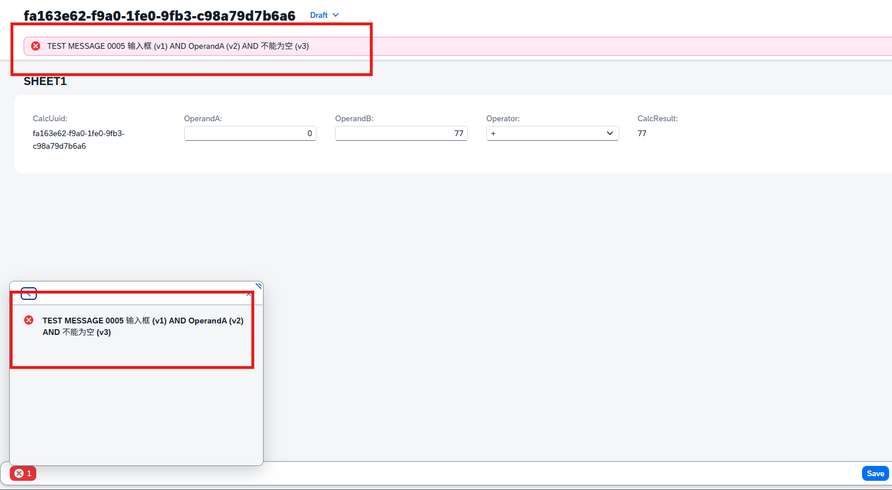
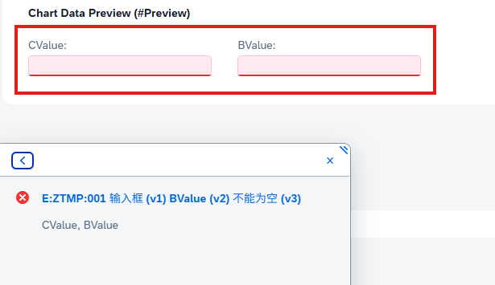
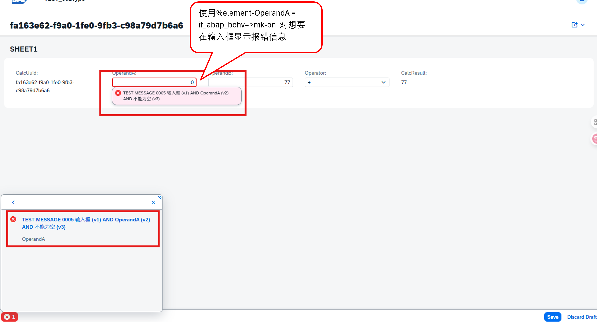
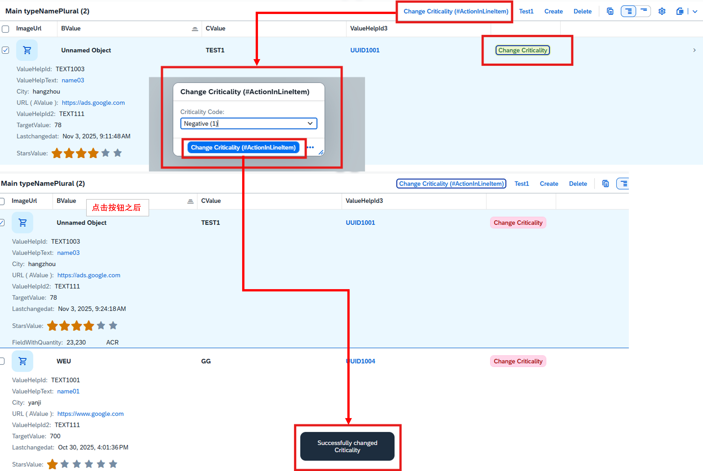

## Message

> %CID： 相关实例的ID
> 
> [%MSG](#msg)： 填充消息包装类的一个实例
> 
> [%ELEMENT](#element)： 列出消息所涉及实体的所有字段或关联关系，需要同时指定 %element 和 %TKY
> 
> %STATE_AREA： 如果此字符串类型的组件被填充，框架会将消息解析为状态消息
> 
> %OP： 此组件指示消息与哪个已执行的操作相关。此组件仅对转移消息有效
> 
> %OTHER： 报告结构为每个已定义的实体包含一个表，并额外设有 %OTHER 组件用于容纳所有与实体无关的消息。当消息与业务对象实体无关时（未绑定消息），%OTHER 组件会填充消息包装类的一个实例
> 
> %PATH（仅与子实体相关）： 路径组件将子实体映射到其父级。如果业务对象包含多个子实体，则会扩展 %PATH 组件以将该子实体映射到其父级及业务对象根级


## %msg 
> id 为系统消息类 可直接设置例如‘ZTMP’等。也可在Texts中Message Classes 中统一设置信息。
>
> 在Message Classes可设置消息编号(number),还可以设置消息文本（Short Text）,在设置short text中可用‘&’加数字，用v1等对其传值赋值
> 
Message Classes (YCX_NES_TEST01)


#### Severity
> Severity是否为 成功、信息、警告或错误消息。
> 
> if_abap_behv_message=>severity-success: 成功消息通知用户流程或作已成功完成。用户端无需执行任何作。请注意，在某些情况下会省略成功消息。
> 
> if_abap_behv_message=>severity-information: 信息消息提供有关流程或作的其他信息。用户端无需执行任何作。
> 
> if_abap_behv_message=>severity-warning: 警告表示可能需要在用户端执行作
> 
> if_abap_behv_message=>severity-error: 发生错误，需要在用户界面上执行作


#### if_abap_behv=>mk-on
> 对想要的输入框设置报错信息  %element-OperandA = if_abap_behv=>mk-on
>
> 如果不设置%element-OperandA = if_abap_behv=>mk-on 报错信息会显示在Header上




## %ELEMENT
> 使用该 %ELEMENT 组件，您可以将消息分配给一个或多个目标字段
>
> 这边使用的字段是bvalue 和 cvalue
>
Classes
```
 LOOP AT roots ASSIGNING FIELD-SYMBOL(<root>).
        IF <root>-BValue IS INITIAL.
          APPEND VALUE #( %tky        = <root>-%tky ) TO failed-ycx_r_mainshow.   
          APPEND VALUE #( %tky                 = <root>-%tky
                          %msg                 = new_message(
                        id       = 'ZTMP'           " 系统消息类
                        number   = '001'          " 通用消息编号
                        severity = if_abap_behv_message=>severity-error
                        v1       = '输入框 (v1)' " 作为变量传递
                        v2       = 'BValue (v2)'
                        v3       = '不能为空 (v3)'
                    )
                          %element-bvalue      = if_abap_behv=>mk-on
                          %element-cvalue      = if_abap_behv=>mk-on
                          ) TO reported-ycx_r_mainshow.
        ENDIF.
```


## 例1
> 在edit模式下点击save按时会检查OperandA输入框是否为空或零时报错显示报错信息
> 
Behavior
```
validation Validation_Numeric on save {
    field OperandA;
}
```

Classes
```
METHOD Validation_Numeric.
READ ENTITIES OF YCX_R_TEST_001 IN LOCAL MODE
ENTITY YCX_R_TEST_001
    FIELDS ( OperandA  )
    WITH CORRESPONDING #( keys )
    RESULT DATA(calculators).

LOOP AT calculators INTO DATA(calculator) .
    IF calculator-OperandA IS INITIAL.
        APPEND VALUE #( %tky = calculator-%tky ) TO failed-ycx_r_test_001.  
        APPEND VALUE #(
            %tky = calculator-%tky
            %msg = new_message(
                        id       = 'YCX_MES_TEST01'           " 系统消息类
                        number   = 005          " 通用消息编号
                        severity = if_abap_behv_message=>severity-error
                        v1       = '输入框 (v1)' " 作为变量传递
                        v2       = 'OperandA (v2)'
                        v3       = '不能为空 (v3)'
                    )
            %element-OperandA = if_abap_behv=>mk-on
        ) TO reported-ycx_r_test_001.

    ENDIF.
ENDLOOP.
ENDMETHOD.
```



## 例2
> 以下是点击按后更新成功有提示效果
> 按钮内部功能类似写法请看[Behavior](Behavior/Behavior.md)中action

Classes 
```
METHOD changeCriticality.

    ...按钮点击后具体功能

*   更新成功后的提示
    APPEND VALUE #( %msg = new_message_with_text(
                    severity = if_abap_behv_message=>severity-success
                    text = 'Successfully changed Criticality' ) )
                    TO reported-ycx_r_mainshow.
ENDMETHOD.
```



## 例3
> 会以弹窗的形式报错
```
READ ENTITIES OF ycx_test001_data IN LOCAL MODE
ENTITY ycx_test001_data
    FIELDS ( Name  )
    WITH CORRESPONDING #( keys )
    RESULT DATA(peoples).

LOOP AT peoples INTO DATA(people) .
    APPEND VALUE #( %tky = people-%tky ) TO failed-ycx_test001_data.  "当发现错误failed-ycx_test001_data可以阻止数据存入表中
    IF people-Name <> '陈旭'.
        APPEND VALUE #( %tky = people-%tky
                        %msg = new_message_with_text(
                        severity = if_abap_behv_message=>severity-error
                        text = 'Name 值得为 陈旭' ) )
                        TO reported-ycx_test001_data.

    ENDIF.
ENDLOOP.
```
