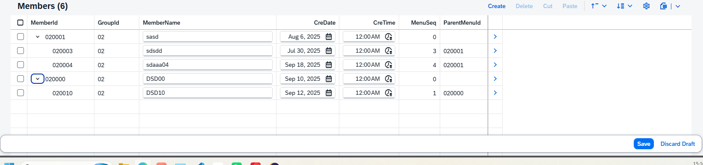

## 树状表



behavior  ( YCX_R_GROUP )
```
managed implementation in class zbp_cx_r_group unique;
strict ( 2 );
with draft;

define behavior for YCX_R_GROUP //alias <alias_name>
persistent table ycxgroup
draft table ycxgroup_d
lock master
total etag GroupId
authorization master ( instance )
etag master GroupId
{
  create ( authorization : global );
  update;
  delete;
  field ( readonly ) GroupId;
  field ( mandatory : create )GroupId, GroupName;
  association _Managers { create{default function GetDefaultsForCopy;} with draft; }
  association _Members { create{default function GetDefaultsForChild;} with draft; }

  draft action Resume;
  draft action Edit;
  draft action Activate optimized;
  draft action Discard;
  draft determine action Prepare{}

    mapping for ycxgroup
    {
        GroupId = group_id;
        GroupName = group_name;
    }
}

define behavior for YCX_R_MANAGER //alias <alias_name>
persistent table ycxmanager
draft table ycxmanager_d
lock dependent by _Group
authorization dependent by _Group
etag master CreDate
{
  update;
  delete;
  field ( readonly )GroupId;
  field ( mandatory : create ) ManagerId, ManagerName;

  side effects {
    field ManagerId affects field ManagerName;
  }

  determination Copy on modify { field ManagerId;}
  association _Group{ with draft;}

  mapping for ycxmanager
    {
        CreDate = cre_date;
        CreTime = cre_time;
        GroupId = group_id;
        ManagerId = manager_id;
        ManagerName = manager_name;
        ClassId = class_id;
        MenuSeq = menu_seq;
    }
}

define behavior for YCX_R_MEMBER //alias <alias_name>
persistent table ycxmember
draft table ycxmember_d
lock dependent by _Group
authorization dependent by _Group
etag master CreDate
{
  update;
  delete;
  field ( readonly )GroupId;
  field ( mandatory : create ) MemberId,MemberName;
  field (readonly : update)ParentMenuId;
  field(readonly : update)MenuSeq;

  association _Group{with draft;}
  association _Member
  {
    with draft;
    link action linkParentMenu;
    unlink action unlinkParentMenu;

  }

  association _ChildMember { with draft;}


  instance hierarchy YCX_TEXT_TREE
  {
    managed reorder action changeSeq;
    field ( hierarchy-index ) MenuSeq;
    ascending association _Member;
    descending association _ChildMember{ with cascading delete; }

 }
    mapping for ycxmember
    {
        CreDate = cre_date;
        CreTime = cre_time;
        GroupId = group_id;
        MemberId = member_id;
        MemberName = member_name;
        ClassId = class_id;
        MenuSeq = menu_seq;
        ParentMenuId = parentmenu_id;
    }
}
```


## cds

cds （ 父 YCX_I_GROUP ）
```
@AccessControl.authorizationCheck: #NOT_REQUIRED
@EndUserText.label: 'YCX_I_GROUP'
@Metadata.ignorePropagatedAnnotations: true
define root view entity YCX_I_GROUP as select from ycxgroup
  composition  of exact one to many YCX_I_MANAGER as _Managers
  composition  of exact one to many YCX_I_MEMBER as _Members
{
    key group_id as GroupId,
    group_name as GroupName,
    _Managers,
    _Members
   
}

```

cds ( 父 YCX_R_GROUP )
```
@AccessControl.authorizationCheck: #NOT_REQUIRED
@EndUserText.label: 'YCX_R_GROUP'
@Metadata.ignorePropagatedAnnotations: true
define root view entity YCX_R_GROUP as select from YCX_I_GROUP
composition of exact one to many YCX_R_MANAGER as _Managers
composition of exact one to many YCX_R_MEMBER as _Members
{
    key GroupId,
    GroupName,
    /* Associations */
    _Managers,
    _Members
}
```

cds ( 父 YCX_C_GROUP )
```
@AccessControl.authorizationCheck: #NOT_REQUIRED
@EndUserText.label: 'YCX_C_GROUP'
@Metadata.ignorePropagatedAnnotations: true
@Metadata.allowExtensions: true
define root view entity YCX_C_GROUP
provider contract transactional_query as projection on YCX_R_GROUP
{
    key GroupId,
    GroupName,
    /* Associations */
    _Managers:redirected to composition child YCX_C_MANAGER,
    _Members: redirected to composition child YCX_C_MEMBER
}

```

cds ( 子 YCX_I_MEMBER )
```
@AccessControl.authorizationCheck: #NOT_REQUIRED
@EndUserText.label: 'YCX_I_MEMBER'
@Metadata.ignorePropagatedAnnotations: true
define view entity YCX_I_MEMBER as select from ycxmember
association to parent YCX_I_GROUP as _Group on $projection.GroupId = _Group.GroupId
association of many to one YCX_I_MEMBER as _Member on $projection.GroupId = _Member.GroupId
                                        and $projection.ParentMenuId = _Member.MemberId
association of one  to many YCX_I_MEMBER as _ChildMember on $projection.GroupId = _ChildMember.GroupId
                                        and $projection.MemberId = _ChildMember.ParentMenuId

{
    key member_id as MemberId,
    key group_id as GroupId,
    class_id as ClassId,
    menu_seq as MenuSeq,
    parentmenu_id as ParentMenuId,
    member_name as MemberName,
    cre_date as CreDate, 
    cre_time as CreTime,
    _Group,
    _Member,
    _ChildMember  
}

```

cds ( 子 YCX_R_MEMBER )
```
@AccessControl.authorizationCheck: #NOT_REQUIRED
@EndUserText.label: 'YCX_R_MEMBER'
@Metadata.ignorePropagatedAnnotations: true
@ObjectModel.usageType:{
    serviceQuality: #X,
    sizeCategory: #S,
    dataClass: #MIXED
}
define  view entity YCX_R_MEMBER as select from YCX_I_MEMBER

association to parent YCX_R_GROUP as _Group on $projection.GroupId = _Group.GroupId
association of many to one YCX_R_MEMBER as _Member on $projection.GroupId = _Member.GroupId 
                                        and $projection.ParentMenuId = _Member.MemberId
association of one  to many YCX_R_MEMBER as _ChildMember on $projection.GroupId = _ChildMember.GroupId
                                        and $projection.MemberId = _ChildMember.ParentMenuId

{
    key MemberId,
    key GroupId,
    ClassId,
    MenuSeq,
    ParentMenuId,
    MemberName,
    CreDate,
    CreTime,
    /* Associations */
    _Group,
    _Member,
    _ChildMember
}

```

cds ( 子 YCX_C_MEMBER )
> 需添加 @OData.hierarchy.recursiveHierarchy: [{ entity.name: 'YCX_TEXT_TREE' }]
```
@AccessControl.authorizationCheck: #NOT_REQUIRED
@EndUserText.label: 'YCX_C_MEMBER'
@Metadata.ignorePropagatedAnnotations: true
@Metadata.allowExtensions: true

@OData.hierarchy.recursiveHierarchy: [{ entity.name: 'YCX_TEXT_TREE' }]  //必须得加

@ObjectModel.usageType:{
  serviceQuality:#X,
  sizeCategory:#S,
  dataClass:#MIXED
}
define view entity YCX_C_MEMBER as projection on YCX_R_MEMBER
{
    key MemberId,
    key GroupId,
    ClassId,
    MenuSeq,
    MemberName,
    ParentMenuId,
    CreDate,
    CreTime,
    /* Associations */
    _Group:redirected to parent YCX_C_GROUP,
    _Member:redirected to YCX_C_MEMBER,
    _ChildMember:redirected to YCX_C_MEMBER
}
```

define hierarchy ( YCX_TEXT_TREE )
```
@AccessControl.authorizationCheck: #NOT_REQUIRED
@EndUserText.label: 'Menu Hierarchy Node'
define hierarchy YCX_TEXT_TREE
with parameters
    P_GroupId : abap.char(10)
  as parent child hierarchy (
    
    source YCX_R_MEMBER
    
    child to parent association _Member
    
    directory _Group filter by
      GroupId = $parameters.P_GroupId
    
    start where ParentMenuId is initial 

    siblings order by 
    MenuSeq ascending
  )
{
    key MemberId,
    key GroupId,
    ClassId,
    ParentMenuId,
    MenuSeq
}

```


## metadata
> 这边显示树状在     { id:'MembersId',
    purpose: #STANDARD,
    type: #PRESENTATIONVARIANT_REFERENCE,
    label: 'Members',
    position: 30 ,
    targetElement:'_Members',
    targetQualifier:'MEMBER_Variant'} 这一部分
>
YCX_C_GROUP 
> 这边使用 type: #PRESENTATIONVARIANT_REFERENCE  ，targetElement:'_Members' 和
    targetQualifier:'MEMBER_Variant'配合 YCX_C_MEMBER 中的 @UI.presentationVariant 使用
```
@Metadata.layer: #CORE
@Search.searchable: true
annotate entity YCX_C_GROUP
    with 
{
@UI.facet: [
    ...

    { id:'MembersId',
    purpose: #STANDARD,
    type: #PRESENTATIONVARIANT_REFERENCE,
    label: 'Members',
    position: 30 ,
    targetElement:'_Members',
    targetQualifier:'MEMBER_Variant'}
]
    ...
    
}
```

YCX_C_MEMBER
> presentationVariant用法请看 [@UI.presentationVariant](@UI.presentationVariant.md)
```
@Metadata.layer: #CORE
@UI.presentationVariant: [{
  qualifier: 'MEMBER_Variant',
  maxItems: 5,
  visualizations: [{type: #AS_LINEITEM}]
}]

annotate entity YCX_C_MEMBER
    with 
{
    ...  
}
```

## table
ycxgroup
```
@EndUserText.label : 'YCXGROUP'
@AbapCatalog.enhancement.category : #NOT_EXTENSIBLE
@AbapCatalog.tableCategory : #TRANSPARENT
@AbapCatalog.deliveryClass : #A
@AbapCatalog.dataMaintenance : #RESTRICTED
define table ycxgroup {

  key client   : abap.clnt not null;
  key group_id : abap.char(10) not null;
  group_name   : abap.char(255);

}
```


ycxmember
```
@EndUserText.label : 'YCXMEMBER'
@AbapCatalog.enhancement.category : #NOT_EXTENSIBLE
@AbapCatalog.tableCategory : #TRANSPARENT
@AbapCatalog.deliveryClass : #A
@AbapCatalog.dataMaintenance : #RESTRICTED
define table ycxmember {

  key client    : abap.clnt not null;
  key member_id : abap.char(10) not null;
  key group_id  : abap.char(10) not null;
  class_id      : abap.char(10);
  menu_seq      : abap.int4;
  parentmenu_id : abap.char(10);
  member_name   : abap.char(255);
  cre_date      : abap.dats;
  cre_time      : abap.tims;

}
```

[回到顶部](#)