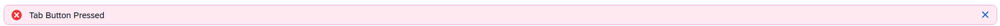
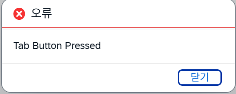
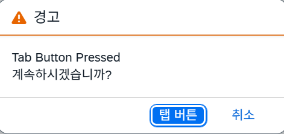
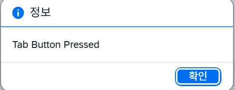
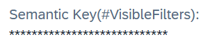
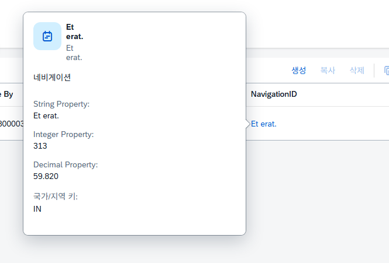
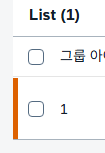

# Metadata Annotation用法
 1. **isPartOfPreview ： 展开/折叠**<br>
   **True: 展开  False : 折叠**
 ```abap
 @UI.facet: [
   {
      parentId   : 'chartDataCollection',
      label      : 'Chart Data Preview (#Preview)',
      type       : #FIELDGROUP_REFERENCE,
      targetQualifier: 'chartDataPreview',
      isPartOfPreview: true
   }
 ]
 ```  

2. **编辑模式下可见**(상세화면 리스트에서도 먹히는지 확인 필요)
```abap
hidden: #( IsActiveEntity )
```

3. **制作Field Group方法**
```abap
@UI.facet: [
   {
      parentId: 'SonTab1',          "我要插入的ID
      label: 'First Group',         "Field Group名称
      type: #FIELDGROUP_REFERENCE,  
      targetQualifier: 'FGGroup',   "Field Group ID, 
      isPartOfPreview: false        "折叠显示/展开显示
   }
]

{
   @UI: {
      fieldGroup: [
      {
         qualifier: 'FGGroup',   "Field Group ID
         label: '첫번째 탭 그룹' 
      }
      ]
   }
   GroupId;
}
```

4. **制作父子标签页的方法**
```abap
@UI.facet: [
   {
      purpose: #STANDARD,
      position: 10,
      type: #COLLECTION,
      label: '첫번째 탭',
      id: 'FirstTab'
  },
  {
      purpose: #STANDARD,
      position: 10,
      type: #COLLECTION,
      label: '자매 탭1',
      id: 'SonTab1',
      parentId: 'FirstTab'
  },
  {
    purpose: #STANDARD,
    position: 20,
    type: #COLLECTION,
    label: '자매 탭2',
    id: 'SonTab2',
    parentId: 'FirstTab'
  }
]
```
5. **制作List按钮**
```abap
@UI.lineItem: [
   { 
      type: #FOR_ACTION,
      label: '리스트 버튼',
      dataAction: 'ListButton',
      position: 40,
      inline: true "true: 显示在表格里, false: 显示在表格上端
   }
]
```

6. **点击按钮打开报错消息(1)**
```abap
  METHOD TabButton.
    READ ENTITIES OF zll_r_test1 IN LOCAL MODE
        ENTITY main
          ALL FIELDS WITH CORRESPONDING #( keys )
        RESULT DATA(lt_result)
        FAILED failed.
    LOOP AT lt_result ASSIGNING FIELD-SYMBOL(<fs_data>).
        APPEND VALUE #( %tky = <fs_data>-%tky ) TO failed-main.
        APPEND VALUE #( %tky = <fs_data>-%tky
                        %msg = new_message_with_text(
                            severity = if_abap_behv_message=>severity-error
                            text     = 'Tab Button Pressed'
                        )
                      ) TO reported-main.
    ENDLOOP.
  ENDMETHOD.
```



7. **点击按钮打开报错消息(2)**
```abap
APPEND VALUE #( %msg = new_message_with_text(
                  severity = if_abap_behv_message=>severity-success
                  text     = 'Tab Button Pressed'
                  )
               )  TO reported-main.
```
* SUCCESS - 成功<br>

* ERROR - 错误<br>

* WARNING - 警告<br>

* INFORMATION - 信息<br>


8. **制作星评分**
```abap
  @UI:{ 
    dataPoint:{
        qualifier: 'Stars',
        targetValue: 6,
        visualization: #RATING,
        title: 'aaa'
    },
    lineItem: [
    {
        type:#AS_DATAPOINT,
        importance: #LOW,
        position: 110,
        label: '별 평점'  
    }],
    fieldGroup: [
    {
        qualifier: 'FGStar',
        type:#AS_DATAPOINT,
        label: '별 평점 수정'
    }]
  }
```

- dataPoint:制作样式的部分(qualifier的值必须要和字段名称一样) 
- targetValue： 星星的个数

9. **密码效果**
```abap
 masked: true
```


10. **制作Navigation**
```abap
  "在CDS View里连接navigation要做的表格
   @ObjectModel.foreignKey.association: '_Navigation'
   navigation_id         as NavigationID,
```


11. **字段加粗显示**
```abap
"只对LIST字段起作用
@ObjectModel.semanticKey: ['LocalLastChangedBy']
```

12. **行设置颜色**
```abap
   "ChartColor: 颜色字段(必须要使用字段不能输入数字)
   @UI.lineItem: [{ criticality: 'ChartColor' }]
```

* 颜色可以给按钮也加颜色  
```abap
    criticality: 'ChartColor' 
```

13. testsetet